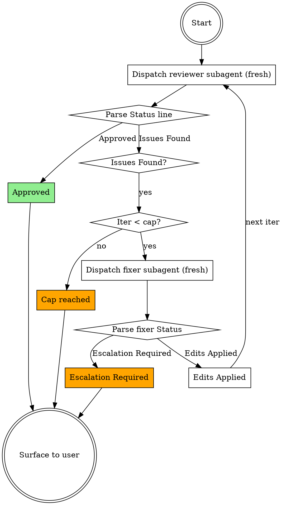

## Your Task

You are the orchestrator. The user invoked `/review-spec` and provided one or more document paths as arguments. Your job: drive a review-and-fix loop using two clean-context subagents (reviewer and fixer), surface the outcome to the user, and never edit the document yourself.

## Inputs

- **Document path(s):** taken from the user's invocation arguments. If absent, ask the user for absolute paths and stop.
- **Codebase root:** the worktree that contains the document — resolved in Step 0.1, **not** assumed to be your CWD. With worktrees, the spec/plan and the code it grounds against live in a checkout that is often *not* where you were invoked.

## Step 0 — Persist before dispatch (ALWAYS)

Before any subagent dispatch, every document under review **must exist on disk** at a stable path. Subagents run in isolated contexts and read inputs via the `Read` tool; an in-memory document does not survive the dispatch boundary, and the next iteration would re-read the unfixed file and contradict itself.

| Caller state | Action |
|---|---|
| User passed real file path(s) that exist on disk | Continue to Step 1. |
| Doc was just produced in this session by `brainstorming` / `writing-plans` and SAVED to a path | Confirm the file exists on disk via a `Read` call before Step 1. Do not assume. |
| Doc only exists in chat (in-memory, not yet persisted) | STOP. Tell the user: "The document is not on disk. To run `/review-spec` I need to persist it first to a stable path." Offer a default location appropriate to the framework in use (superpowers → `docs/superpowers/specs/YYYY-MM-DD-<topic>-design.md` or `.../plans/YYYY-MM-DD-<feature>.md`; Spec Kit → `specs/<NNN>-<feature>/spec.md` or `plan.md`; OpenSpec → `openspec/changes/<id>/proposal.md` or `tasks.md`; otherwise ask). After the user confirms, write the document verbatim to the chosen path, then continue. |
| Path was given but file does not exist | STOP. Surface a Failure: `Path does not exist: <path>. Persist the document first.` |

Do not paraphrase the document into the subagent prompt as a workaround — that defeats the clean-context guarantee. The subagent must `Read` the file from disk.

## Step 0.1 — Resolve the codebase root (worktree-aware)

Plans and designs are routinely written/executed in an **isolated worktree** (superpowers
`using-git-worktrees` puts them under `.worktrees/<name>/`, `worktrees/`, or a sibling `../<name>/`),
while you may have been invoked from the main checkout. A clean-context subagent has no way to know
this — if you hand it the wrong root, its codebase-grounding checks read the *main* branch's files
instead of the worktree's, producing phantom "X doesn't exist / contradicts the code" findings (or
silently passing real ones). The root **must be the worktree that owns the document**, derived from
the document's own location:

1. **Derive from the doc, not CWD.** For the first document path, take its directory and run
   `git -C "<doc-dir>" rev-parse --show-toplevel`. That toplevel is the authoritative codebase root —
   it resolves to whichever worktree the file physically lives in. Use it as `<CODEBASE_ROOT>`.
2. **If that fails or feels ambiguous** (doc outside any repo, multiple docs in different roots, or
   you're unsure which checkout is "live"), run `git -C "<doc-dir>" worktree list` and inspect the
   output: each line is `<path>  <sha>  [<branch>]`. Match the document's path prefix to a worktree
   `<path>`; that path is the root. If several docs map to *different* worktrees, that's a red flag —
   stop and ask the user which checkout to ground against (do not silently pick one).
3. **Pass the resolved worktree root** as `<CODEBASE_ROOT>` to **both** the reviewer and the fixer.
   Never default to your CWD or the main repo root when the document lives in a worktree.

**The plan's declared paths win — do not normalize them to convention.** A plan may
deliberately declare a worktree/target outside the ambient convention (e.g. a cross-repo
execution that creates `../.worktrees/target-repo/<wt>` even though `CLAUDE.md` /
`CLAUDE.local.md` recommend `.claude/worktrees/`). For *this* review, authority runs:
**(1) the explicit paths in the plan/spec under review → (2) `CLAUDE.local.md` → `CLAUDE.md`
→ (3) Claude's default recommendation.** The reviewer grounds against the paths the plan
declares, AS DECLARED; it must not flag them merely for diverging from convention, and must
not "correct" them toward `.claude/worktrees`. Carry this precedence into the reviewer prompt.

**Cross-repo plans have more than one root.** If the document references files in a second
repo/worktree (a target repo it acts on), don't force a single `--show-toplevel`. Capture each
**declared** root from the plan, label which references belong to which root, and pass the set
so the reviewer grounds each claim against the right checkout instead of chasing references
across both. If the roots are unclear, run `git worktree list` in each repo and ask once.

Record the result as `CODEBASE_ROOT` (one root, or a labeled set for cross-repo plans).

## Step 0.5 — Detect framework, resolve its profile, classify archetype

The reviewer/fixer are clean-context subagents — give them the framework's rules as a **file
path**, not prose. You (orchestrator, in the user's session, with web access) do the detection
and any research; they just `Read` the profile. Three sub-steps:

First resolve `SEEDS_DIR` and `CACHE_DIR` to absolute paths (see Constants) — every profile path
below and the `FRAMEWORK_PROFILE_PATH` you pass to subagents must be absolute, never a bare
relative `references/frameworks/…`.

**A. Detect the framework.** Match the document path + nearby project markers against the
`detection_signals` of the known profiles (bundled seeds in `SEEDS_DIR`). Conversation signal
wins: if the user just used a framework's skill (superpowers `brainstorming`/`writing-plans` →
`superpowers`), use it. If markers are ambiguous, ask once.

**B. Resolve the profile** (an **absolute** path on disk), in order:
1. `CACHE_DIR/<id>.md` if it exists and isn't stale → use it.
2. else the bundled seed `SEEDS_DIR/<id>.md` → use it.
3. else **unknown framework** → research it (web: official repo/docs), write a new profile to
   `CACHE_DIR/<id>.md` following `SEEDS_DIR/SCHEMA.md` (frontmatter + conventions), set
   `last_updated` to today, then use it. Tell the user one line: "Learned framework `<id>`;
   cached its profile."

Staleness: a cached profile for a known-to-drift framework (`bmad`, `gsd`) older than ~180 days
is a refresh candidate — you may re-research and rewrite the **cache** copy (bump
`last_updated`). Never overwrite a bundled seed in place. Record the resolved path as
`FRAMEWORK_PROFILE_PATH` (or `none` if you genuinely can't resolve a framework, e.g. generic
`docs/rfcs/` — the reviewer then uses generic checklists).

**C. Classify the archetype** from the resolved profile's `doc_types` (glob → archetype).
Conversation signal still wins (`brainstorming` → a fused `intent+requirements+design` design
doc; `writing-plans` → `plan`). A `fused` doc yields several archetypes — pass them all. If the
path matches no `doc_types` glob, fall back to content shape (see the reviewer skill's archetype
table) or ask. Record as `ARCHETYPE` (one or more of: `intent`, `requirements`, `design`, `plan`).

Pass both `FRAMEWORK_PROFILE_PATH` and `ARCHETYPE` to the reviewer and fixer below.

## Step 0.6 — Scope the review to the project's lifecycle stage

Frameworks have stages (GSD: context/discussion → requirements → roadmap → research → plan →
status; OpenSpec: proposal → design → specs → tasks; superpowers: design → plan). Reviewing an
early-stage document as if it were a finished plan is the most common failure — e.g. invoked in
GSD with only `PROJECT.md`/CONTEXT present, the reviewer demands tasks and exact files that the
*intent* stage does not have yet. Don't. Resolve scope before dispatch:

1. **See what exists.** Glob the profile's `doc_types` against the project root. The
   furthest-along present archetype (per the profile's `lifecycle_order`) is the **current
   stage**.
2. **Review each existing document at its own archetype** — the `ARCHETYPE` from Step 0.5 is
   per-document and is the ceiling. Never escalate an upstream doc to a downstream checklist:
   a bare `intent`/CONTEXT is judged on why/what clarity and scope, **not** on missing tasks,
   files, or interfaces. (The reviewer skill enforces this too; set the right `ARCHETYPE` so it
   never has to guess.)
3. **Missing required prerequisites are gaps, not defects.** A `required: true` doc-type absent
   at or before the current stage → note it to the user as a prerequisite to produce next, not
   as a finding inside an existing document.
4. **Insufficient-info guard.** If the user asked to review an artifact a later stage hasn't
   produced (e.g. "review the plan" but only `intent` exists), STOP and surface:
   `Only <existing docs> exist; the project is at the <stage> stage. There is no <requested
   archetype> to review yet. I can review <existing> as <archetype>, or wait until <next
   stage> is produced.` Do not invent a deeper review or ask for downstream detail.

When the user passed explicit path(s), review exactly those at their archetypes — do not pull
in downstream scope. When the user passed none ("review my specs"), review every existing doc
at its archetype and list the gaps.

## Constants

- **Reviewer skill:** `reviewing-specs`
- **Fixer skill:** `applying-review-feedback`
- **Subagent type for both:** `general-purpose`
- **Subagent model for both:** `sonnet` (Haiku misses subtle defects; Opus burns tokens for no extra review-quality signal)
- **Iteration cap:** 3 (configurable per invocation if user requests)
- **Loop state file (optional):** `/tmp/review-spec-<doc-basename>-<timestamp>.log` — append iter# + status line each round, for debugging only.
- **Framework profile seeds dir** (`SEEDS_DIR`) — resolve once to an **absolute** path before any
  use: `${CLAUDE_PLUGIN_ROOT}/skills/reviewing-specs/references/frameworks/`. `CLAUDE_PLUGIN_ROOT`
  is exported to this plugin command; if it's unset, fall back to
  `~/.claude/plugins/uz-kit/skills/reviewing-specs/references/frameworks/`. It holds the curated
  seed profiles `<id>.md` and the format spec `SCHEMA.md`. **Never reference these as a bare
  relative `references/frameworks/…`** — your CWD is the user's repo (often a worktree), not the
  plugin, so a relative path resolves to a nonexistent file there. (That mis-resolution is exactly
  why a review can silently fail to find profiles when run in another repo.)
- **Framework profile cache** (`CACHE_DIR`): `~/.claude/cache/framework-profiles/*.md` (absolute,
  user-global) — learned/refreshed profiles the orchestrator writes for frameworks not covered by a
  seed. Create the dir on first write.

## Loop

Run this loop. Each iteration is one reviewer dispatch followed by (conditionally) one fixer dispatch.



### Step 1 — Dispatch reviewer (every iteration)

Use the `Agent` tool with these exact parameters:

- `subagent_type`: `general-purpose`
- `model`: `sonnet`
- `description`: `review-spec iter N reviewer` (substitute N)
- `prompt`: (template below)

Reviewer prompt template — use VERBATIM, substitute only `<DOC_PATHS>`, `<ARCHETYPE>`, `<FRAMEWORK_PROFILE_PATH>`, and `<CODEBASE_ROOT>`:

```
You are the reviewer.

Step 1: Invoke the Skill tool with skill name "reviewing-specs" and follow it exactly.

Step 2: The orchestrator has pre-resolved:
- ARCHETYPE = <ARCHETYPE>  (one or more of: intent, requirements, design, plan)
- FRAMEWORK_PROFILE_PATH = <FRAMEWORK_PROFILE_PATH>  (a file path on disk, or "none")
Trust these — the orchestrator has project context you don't; skip the skill's own
detection/classification. If FRAMEWORK_PROFILE_PATH is a path, Read it: it encodes this
framework's doc archetypes and review conventions (requirement syntax, delta sections,
ambiguity/parallel markers, constitutional gates) — apply them. If "none", use the generic
archetype checklists.

Step 3: Read every file under review fresh from disk:
<DOC_PATHS>

Step 4: Codebase root(s) for grounding checks: <CODEBASE_ROOT>
Ground claims against these root(s). The paths the document itself declares (worktree/target
locations, cross-repo references) are AUTHORITATIVE for this review — do not flag them or
"correct" them just because they differ from CLAUDE.md / .claude/worktrees convention; only
flag a path if it's internally inconsistent or violates a hard constraint. For cross-repo
input, ground each reference against the root it belongs to; don't chase references across
repos.

Step 5: Apply the checklist for each ARCHETYPE (Intent / Requirements / Design / Plan), plus
the framework conventions from the profile, plus Cross-Document Consistency if multiple files.
ARCHETYPE is the ceiling per document: judge an upstream doc (e.g. intent) only at its own
level — never demand downstream detail (tasks, exact files, interfaces) it isn't meant to have.

Step 6: Emit the report following the skill's output template strictly. Record `<framework> ·
<archetype(s)>` on the `### Document Type` line. End with the `### Status:` line.

Do not assume any context outside what you read. Do not edit any file under review.
```

**CRITICAL:** never include the document content, prior reports, the conversation, or the author's intent in the reviewer prompt. Paths only.

### Step 2 — Parse reviewer Status

Locate the line beginning `### Status:` in the reviewer's output.

| Status | Action |
|---|---|
| `### Status: Approved` | Loop ends. Go to Surface (success). |
| `### Status: Issues Found — fix and re-invoke` | Continue to Step 3 if iter < cap, else go to Surface (cap reached). |
| Any other text on the Status line | Treat as Issues Found (be conservative); log the anomaly. |
| No Status line | Loop ends. Surface failure: "Reviewer did not emit a Status line." |

### Step 3 — Apply findings (when Issues Found, iter < cap)

Save the reviewer's report to a temp file (`/tmp/review-spec-report-iter<N>.md`) so the fixer can `Read` it.

**First decide the fix mode from the profile's `revise_protocol`** for the archetype that has
findings:

- **`mode: direct_edit`** (or no `revise_protocol`, or the flagged archetype isn't in
  `applies_to`) → use the generic fixer subagent (Step 3a).
- **`mode: native_command`** and the flagged archetype is in `applies_to` → route to the
  framework's own planner instead of hand-editing, so its structure/state stay intact (Step 3b).

#### Step 3b — Native revise (framework planner owns this archetype)

The framework regenerates the doc from review notes; do **not** dispatch the direct-edit fixer
for that archetype. Following `revise_protocol.invoke`:

- **`skill:<name>`** → dispatch a fresh subagent that invokes that Skill, passing the report
  path + the document path(s). Parse its result like a fixer Status (Step 4); on success,
  re-review (Step 1).
- **`slash_command`** → if a slash-command tool is available this session, invoke
  `revise_protocol.command` (substitute `{phase_id}`/ids from the doc path or roadmap) with the
  findings, then re-review. If no such tool is available, **fall back to surface**: stop the
  loop and tell the user the exact pre-filled command to run plus the report path, e.g.
  `This plan is owned by the GSD planner. Run: /gsd-plan-phase 2 --reviews  (findings:
  /tmp/review-spec-report-iter<N>.md), then re-run /review-spec.` Do not edit the files yourself.
- **`surface`** → always hand the user the pre-filled command + report path and stop the loop.

If a document has findings split across a native-owned archetype *and* a direct-edit archetype,
handle the direct-edit ones via Step 3a and surface/invoke the native one separately; note both
in the Surface message.

#### Step 3a — Generic fixer (direct edit)

Use the `Agent` tool again, fresh subagent:

- `subagent_type`: `general-purpose`
- `model`: `sonnet`
- `description`: `review-spec iter N fixer`
- `prompt`: template below

Fixer prompt template — use VERBATIM:

```
You are the fixer.

Step 1: Invoke the Skill tool with skill name "applying-review-feedback" and follow it exactly.

Inputs:
- Document(s) to edit: <DOC_PATHS>
- Review report: <REPORT_TEMP_PATH>
- Codebase root: <CODEBASE_ROOT>
- FRAMEWORK_PROFILE_PATH: <FRAMEWORK_PROFILE_PATH>  (a file path on disk, or "none"). If a path,
  Read it and respect the framework's conventions while editing — keep EARS phrasing / RFC-2119
  SHALL, the task-checkbox format, delta section headers; never introduce implementation detail
  into a spec/requirements doc the framework keeps behavior-only.

Apply the skill. Edit the document(s) in place. Emit the structured Fix Summary at the end.

Do not assume any context outside what you read. Do not edit the review report.
```

### Step 4 — Parse fixer Status

Locate the `### Status:` line in the fixer's Fix Summary.

| Status | Action |
|---|---|
| `### Status: Edits Applied` | Increment iter. Go back to Step 1 (re-review with fresh reviewer). |
| `### Status: Escalation Required` | Loop ends. Go to Surface (escalation). |
| `### Status: No Edits` | Loop ends. Go to Surface (escalation — fixer made no progress). |
| No Status line | Loop ends. Surface failure: "Fixer did not emit a Status line." |

### Step 5 — Surface to user

Emit one short message in the user's terminal. Do NOT paste full reports unless the user is at cap or escalation.

| Outcome | Message shape |
|---|---|
| Approved on iter 1 | `Approved on first review. <DOC_PATHS> ready for next step.` |
| Approved after N iters | `Approved after N iteration(s). Doc edited and re-reviewed clean.` |
| Cap reached | `Hit iteration cap (N). Last review still has issues. Final report:\n\n<paste full last reviewer report>\n\nDecide manually.` |
| Escalation Required | `Fixer escalated on iter N. Reason: <fixer's escalation message>. Decide manually.` |
| Native revise handed off | `Findings ready. This <archetype> is owned by <framework>'s planner — run: <pre-filled command>  (findings: <report path>), then re-run /review-spec.` |
| Insufficient info (stage gap) | `Only <existing docs> exist; project is at the <stage> stage. No <requested archetype> to review yet. Reviewed <existing> as <archetype>; produce <next stage> before reviewing it.` |
| Failure | `<failure mode message>. Last available output: <quote brief>.` |

After surfacing, the orchestrator's job is done. Do NOT continue to "next steps" — the user decides whether to invoke `writing-plans`, edit manually, or re-invoke `/review-spec` after their own edits.

## Hard rules for the orchestrator

| Rule | Reason |
|---|---|
| Never edit the document yourself. | Orchestrator is dispatch + parse, not author or fixer. |
| Resolve `CODEBASE_ROOT` from the document's own worktree (Step 0.1), never from your CWD. Use `git worktree list` when unsure. | Grounding the review against the wrong checkout (main vs. the worktree the doc lives in) yields phantom findings and misses real ones. |
| Never include conversation/intent/document-content in subagent prompts. | Subagents must form their own reading from disk. |
| Always dispatch a NEW subagent each iteration. Do not reuse. | Reuse contaminates context with prior round's findings. |
| Reviewer and fixer are separate subagents, never the same. | Fixer must edit; reviewer must not. Separation = audit integrity. |
| Stop at the iteration cap. | Avoid infinite review↔fix loops on irreconcilable disagreement. |
| If reviewer and fixer disagree on a finding's severity across iterations, surface to user. | Orchestrator does not arbitrate. |

## Cleanup

After the loop ends (any outcome), delete the temp report file(s) from `/tmp/`. They are debugging artifacts, not deliverables.
