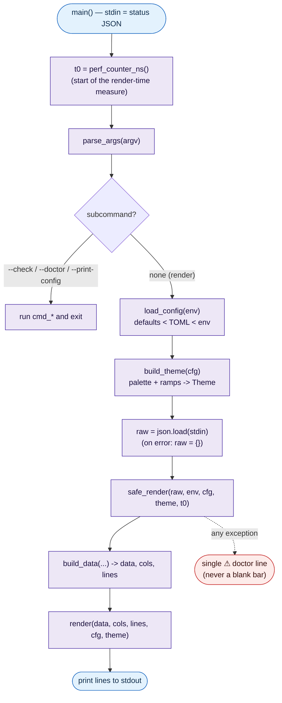
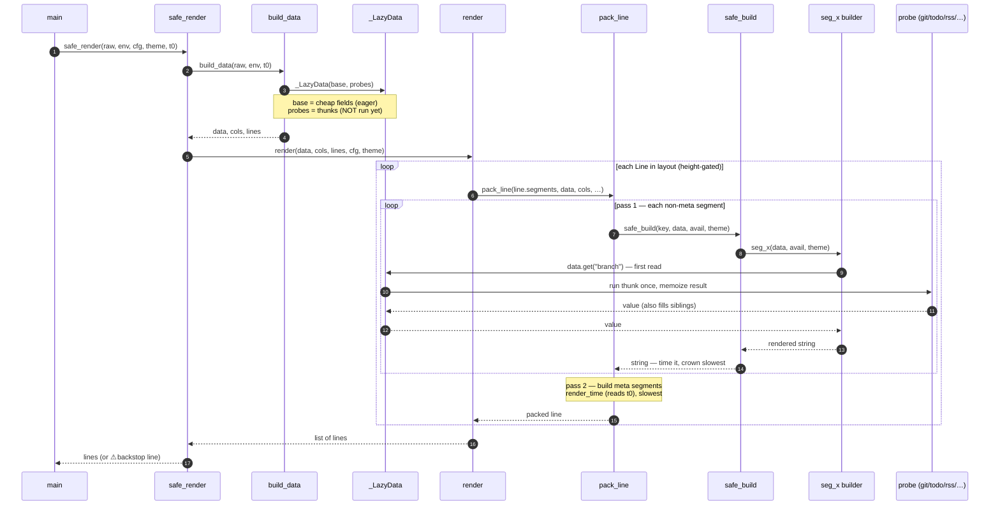
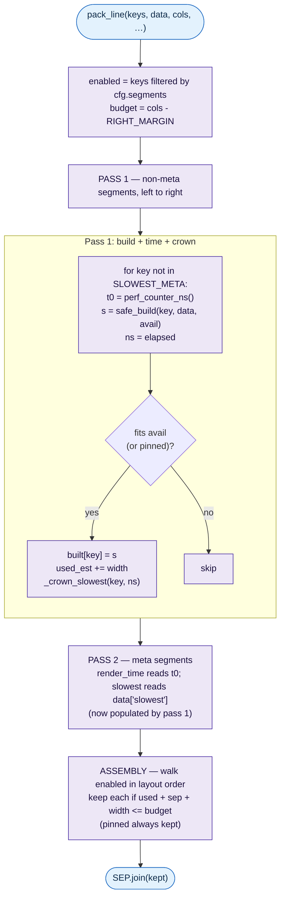
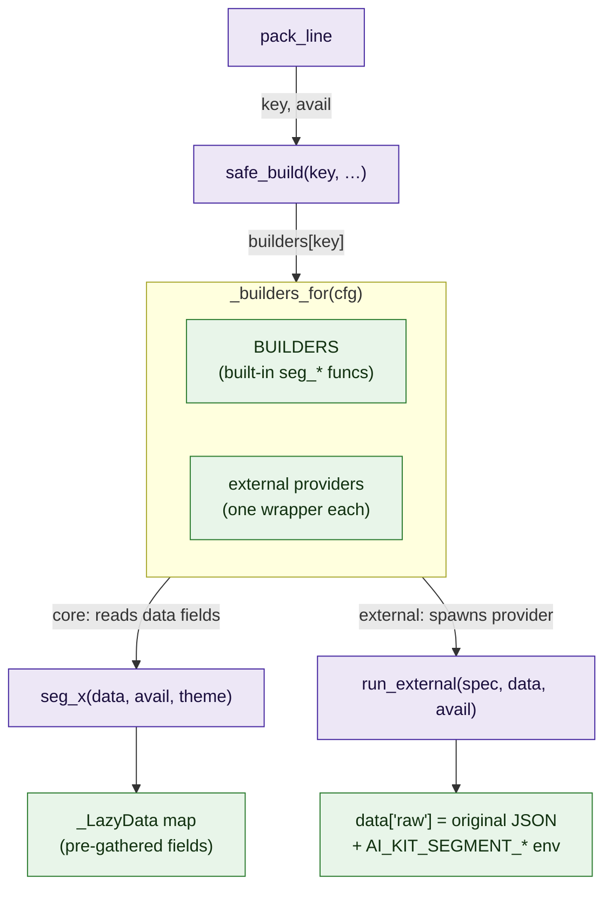
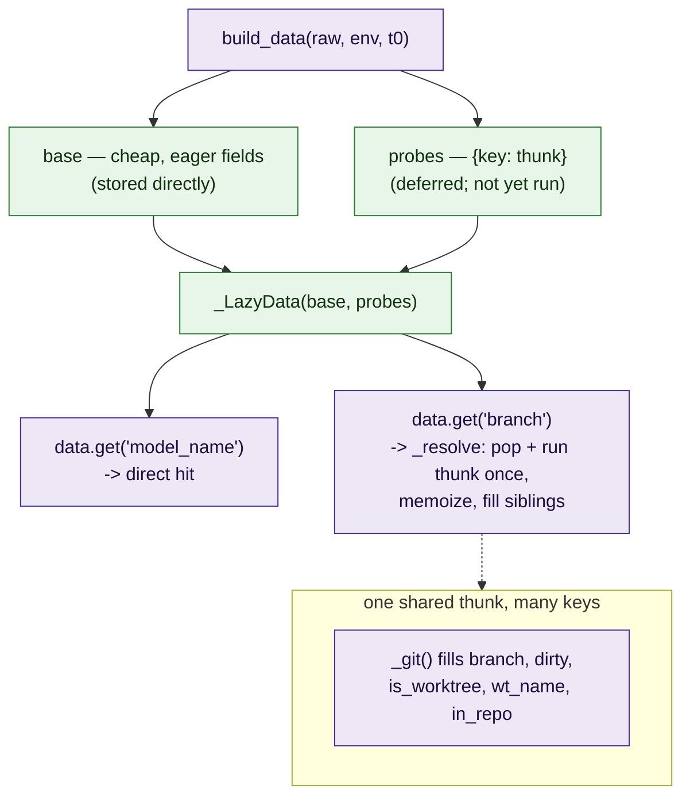
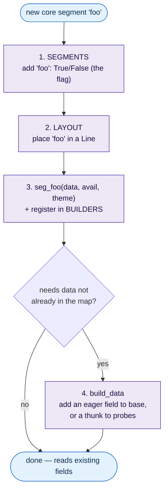

# Status-line render pipeline

How `tools/status-line.py` turns one JSON blob on stdin into the multi-line
status bar — traced from `main()`, with the role of every piece and the exact
points you touch to add or change a segment.

> Runtime is **stdlib-only**: Claude Code pipes a status JSON to the script on
> stdin once per render; the script prints the rendered lines to stdout. There
> is no daemon and no shared state between renders.

---

## 1. Top-level pipeline

`main()` dispatches CLI subcommands first (`--check`, `--doctor`,
`--print-config`); the normal path resolves config, builds the theme, reads the
JSON, and renders.

**Key functions**

| Function | Responsibility |
|---|---|
| `load_config(env)` | Merge internal defaults `<` TOML file `<` env into a `Config` (segments, layout, palette, ramps, `[git]`, external providers). |
| `build_theme(cfg)` | Resolve palette + ramps into a `Theme` (the color lookups builders use). |
| `build_data(raw, env, t0, …)` | Gather everything builders read into one `_LazyData` map. **Segment-agnostic.** |
| `render(...)` | Walk the layout, pack each line, append a diagnostic line if any builder crashed. |
| `safe_render(...)` | Outermost backstop: any unexpected failure becomes a single diagnostic line, never a blank bar. |

---

## 2. One render, end to end

The interesting property: **expensive probes do not run in `build_data`.** They
are deferred and fire inside the *measured build* of the first segment that
reads them, so the `slowest` readout attributes the cost truthfully.

---

## 3. Render core — layout and the two-pass packer

`render` is layout-driven: `cfg.layout` is a list of `Line(min_rows,
[segment keys])`. A line is skipped if the terminal is too short; otherwise
`pack_line` fits it to the width budget.

`pack_line` runs **two passes plus assembly** so the meta segments
(`render_time`, `slowest`) — which report the whole render rather than one
builder — can sit at their declared layout positions instead of being forced
last:

`safe_build` is the **single guarded entry point**: it calls
`builders[key](data, avail, theme)` and, on *any* exception, records the key in
the shared `failed` set and returns a width-bounded `⚠key` marker — so one bad
segment can never blank the bar. `_crown_slowest` tracks the running max into
`data["slowest"]`, skipping meta segments and crashed builders.

---

## 4. How a segment is "built"

Every segment — built-in or external — is reached through **one merged
registry** and **one gate**:

- **Gate:** `cfg.segments.get(key, False)` (the on/off flag).
- **Registry:** `_builders_for(cfg)` = the static `BUILDERS` map merged with one
  synthetic builder per external provider. Every builder has the same shape:
  `seg_x(data, avail, theme) -> str | None`.

This is the crux of the **core vs external** difference:

- A **core** builder reads *pre-gathered fields* from the `_LazyData` map
  (`data.get("branch")`, `data["model_name"]`, …). Those fields are produced
  centrally by `build_data`.
- An **external** provider receives the *original JSON* (`data["raw"]`) plus
  segment metadata on stdin and **gathers its own data** in its own subprocess.
  It never touches `build_data`.

---

## 5. The data layer — `_LazyData`

`build_data` returns a `_LazyData` (a `dict` subclass) with two kinds of entry:

- **`base`** holds fields that are cheap to compute up front: `model_name`,
  `work_dir`, `clock`, the `cost`/`context` numbers, `cols`/`lines`, `t_start`,
  etc.
- **`probes`** holds thunks for the expensive work: git (`branch`/`dirty`/
  worktree fields), transcript `ago`, todo parse, process RSS, effort-auto. A
  thunk runs at most once (first read), memoizes into the dict, and may fill
  several sibling keys in one shot (the single `git_snapshot` feeds all five git
  fields). Builders read via `.get(...)`, so `_resolve` runs on both `.get()`
  and item access.
- **Laziness is the compute gate.** A disabled segment is never built, so its
  field is never read, so its probe never runs. `build_data` itself knows
  *nothing* about which segments are enabled.

---

## 6. Adding or changing a segment — the touch-points

To add a **core** segment, you edit up to four places (all near the top of the
file except the builder):

Adding an **external** segment touches **none** of these: drop an executable
provider in the `[external]` segments dir; `load_config` discovers it, makes its
id a known segment key (enabled by default), and `_place_external` slots it into
the layout. It sources its own data from `data["raw"]`.

---

## 7. Design observation — is `build_data` redundant?

This is a known tension, recorded here rather than hidden.

`build_data`'s `base` dict enumerates every core field by hand. That gives the
render loop a flat, uniform map to read and lets the packer **time** the
gathering as part of each segment's build (truthful `slowest`). The cost is
**coupling**: a core segment that needs new data forces a `build_data` edit
(touch-point 4 above), so the data layer's field list implicitly tracks the core
segment set.

External segments show the alternative shape already in the codebase: a segment
that **owns its own data sourcing** (gets the raw JSON, fetches what it needs)
needs no central registry edit. Pushing core segments toward that model — each
builder declaring/fetching its own inputs through the same lazy, timed path —
would let `build_data` shrink to just the genuinely shared primitives (`raw`,
`work_dir`, `cols`/`lines`, `t_start`) and remove touch-point 4 for most new
segments.

That is a design direction, not a defect in the current behavior — captured so
the trade-off is explicit when the next core segment is added.

---

## Reference — pipeline at a glance

| Stage | Function | Input | Output |
|---|---|---|---|
| Entry | `main` | stdin JSON | printed lines |
| Config | `load_config` | env, TOML | `Config` |
| Theme | `build_theme` | `Config` | `Theme` |
| Data | `build_data` | raw, env, t0 | `_LazyData`, cols, lines |
| Render | `render` | data, cols, lines, cfg, theme | `list[str]` |
| Pack | `pack_line` | one line's keys | one packed string |
| Build | `safe_build` | one key | one segment string (guarded) |
| Backstop | `safe_render` | everything | lines, or one ⚠ line |
