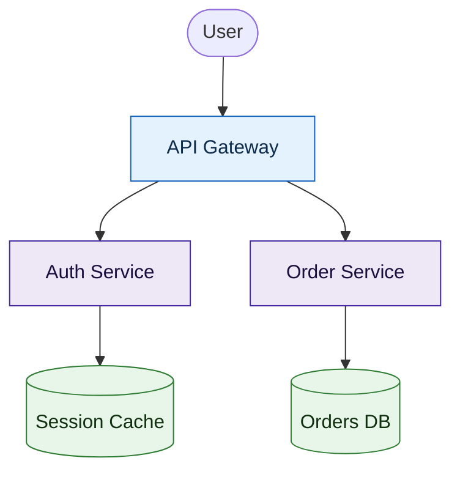

# E2 — mermaid-audit Color-Palette & Shape Guidance Implementation Plan

> **For agentic workers:** REQUIRED SUB-SKILL: Use superpowers:subagent-driven-development (recommended) or superpowers:executing-plans to implement this plan task-by-task. Steps use checkbox (`- [ ]`) syntax for tracking.

**Goal:** Extend `mermaid-audit` beyond syntax/layout to audit each diagram's **color palette**, **render geometry / aspect ratio**, and **node shapes** against objective, reproducible rules, emit ready-to-paste `classDef` fixes, and ship a consensus eval that proves the rules are unambiguous enough that independent agents agree.

**Architecture:** A new stdlib-only analyzer (`scripts/mermaid_style.py`) parses flowchart blocks into *style facts* (classDefs, per-node fills/strokes, node shapes, edge degrees) and runs three rule engines — **color** (contrast/emphasis/garishness via WCAG relative luminance), **shape** (decision/datastore/overload semantics), and **geometry** (aspect ratio / reading-column fit / scroll depth, measured from the rendered PNG via the existing `audit_mermaid.py` render loop). Each rule is a near-binary gate so a violation is flagged the same way by any reviewer. Curated palettes live in `references/palettes.md`; the SKILL gains a Color, Shape & Geometry pass; a consensus eval harness (`evals/`) dispatches K judge agents over labeled fixtures and scores inter-agent agreement against gold labels (geometry, being pixel-measured, is validated by deterministic tests, not the judge panel).

**Tech Stack:** Python 3 (stdlib only — `re`, `dataclasses`, `json`, `argparse`), `unittest`, Mermaid CLI (`mmdc`) for render-verification of examples/palettes, Markdown for skill docs and eval fixtures.

---

## Design principle — objective rules so "a hit is dismissed by many agents"

The user's bar: rules must be **easy to read and reproducible** — if a diagram trips a rule, independent agents should *consistently* flag it (and consistently let clean diagrams pass). We get there two ways:

1. **Computable gates go in the analyzer (deterministic, pytest-covered).** Contrast ratio, "zero styling on a large diagram", distinct-fill count, decision-node-out-degree, datastore-wordlist, distinct-shape count — all yield the same verdict every run. These are CI-tested in `tests/test_mermaid_style.py`.
2. **Judgment-leaning rules go in the SKILL prose + consensus eval.** "Color isn't semantic", "inconsistent shape for same role" — too fuzzy to compute, so they're written as short binary checks and validated by the eval: a rule is *well-formed* only if ≥ 80% of K independent judge agents flag a known-violating fixture and ≤ 20% flag a clean one. Low agreement = the rule wording is too subjective and must be tightened. That harness is the "test to see how good it will be."

Scope note: FR-2.1–2.6 are color-only. Per the user's emphasis, this plan **adds node-shape semantics** as a first-class second axis (shapes guide readability and pair with color to encode meaning). Shape rules are tracked as S-rules alongside the C-rules.

**Rule catalog (stable IDs — reused across analyzer, SKILL, evals):**

| ID | Axis | Gate (binary) | Layer | Severity |
|----|------|---------------|-------|----------|
| C1 | color | flowchart has ≥ 6 nodes and **zero** `classDef`/`style`/`:::`/`class` directives → all-default gray | analyzer | 🟡 flag |
| C2 | color | any styled node's **fill↔stroke** or **fill↔#fff canvas** contrast ratio < 3.0 (WCAG graphics) | analyzer | 🟡 flag (advisory) |
| C3 | color | count of **distinct fills** > 6 → garish | analyzer | 🟡 flag |
| C4 | color | color not semantic (same role ≠ same fill, or unrelated nodes share a fill) | eval/SKILL | 🟡 flag |
| C5 | color | red-family and green-family are the **only** distinguishing fills → color-blind risk | analyzer | 🟡 flag (advisory) |
| S1 | shape | a node with **out-degree ≥ 2 and ≥1 labeled out-edge** drawn as `[]` rect, not `{}` diamond | analyzer | 🟡 flag |
| S3 | shape | node label matches datastore wordlist (`db`, `database`, `store`, `cache`, `queue`, `bucket`, `table`, `s3`) but shape isn't cylinder `[( )]` | analyzer | 🟡 flag |
| S4 | shape | **distinct shape count** > 4 with no class system → shape noise | analyzer | 🟡 flag |
| S5 | shape | same-role nodes use different shapes (inconsistent) | eval/SKILL | 🟡 flag |
| R1 | geometry | rendered **height/width ratio < 0.4** → too horizontal, forces sideways scroll | analyzer (render) | 🟡 flag |
| R2 | geometry | width > GitHub reading column → fit-to-column shrinks node text below ~11px (legible only when expanded) | analyzer (render) | 🟡 flag |
| R3 | geometry | rendered height > ~3 viewport pages (≈3000px) → too vertical, endless scroll | analyzer (render) | 🟡 flag |
| R4 | geometry | big boxes with little text (low text density) → wasted vertical space | eval/SKILL | 🟡 flag |

**Geometry (R-rules) is the readability axis the user cares about most** — "forma" is
chiefly the **rendered aspect ratio**, not just node shapes. Mermaid on GitHub (and most
Markdown viewers) renders into a **fixed reading column** (centered, ~900px content
width) and scales the SVG to fit it preserving aspect ratio. So a wide diagram isn't
panned — it's *shrunk*, and the text becomes unreadable until you click to expand. The
target is a **vertical-leaning** diagram: ratio ≥ 0.4 (taller than 0.4× as tall as wide),
but not so tall it scrolls past ~3 pages. R-rules require the **rendered PNG** (so they
need `mmdc`; they degrade to "not measured" when it's absent), unlike the static C/S
rules. They're validated by deterministic tests + a render check, **not** the consensus
eval (judges read source and can't measure pixels). The lever, as always in flowcharts,
is **`graph TD` + subgraphs + boundary connections** to fold width into height.

---

## File Structure

| File | Responsibility | Action |
|------|----------------|--------|
| `skills/mermaid-audit/scripts/mermaid_style.py` | Parse style facts + color math + C/S rule engines + render-geometry (PNG size, R-rules) + CLI (TSV out, mirrors `audit_mermaid.py`) | Create |
| `skills/mermaid-audit/scripts/audit_mermaid.py` | Wire the geometry pass into the existing render loop (it already produces PNGs) | Modify |
| `skills/mermaid-audit/references/palettes.md` | Curated sober palettes (neutral/structural, accent, old-vs-new) with ready `classDef` blocks + combining guidance | Create |
| `skills/mermaid-audit/SKILL.md` | Add the Color & Shape pass to the workflow + rule summary | Modify |
| `skills/mermaid-audit/template.md` | Add 🎨 COLOR / 🔷 SHAPE rows + summary counts | Modify |
| `skills/mermaid-audit/examples/color-shape.md` | Worked good/bad pairs for each rule | Create |
| `skills/mermaid-audit/examples/good-palette.mmd`, `bad-no-style.mmd`, `bad-garish.mmd`, `bad-decision-rect.mmd` | Runnable fixtures | Create |
| `skills/mermaid-audit/evals/judge-protocol.md` | The prompt/protocol to dispatch K judge agents over a fixture | Create |
| `skills/mermaid-audit/evals/fixtures/*.md` + `gold.json` | Labeled diagrams (which rules each violates) | Create |
| `skills/mermaid-audit/evals/score_consensus.py` | Ingest K verdict JSONs → per-rule agreement + precision/recall vs gold | Create |
| `tests/test_mermaid_style.py` | Deterministic unit tests for the analyzer (added to repo suite) | Create |
| `docs/prds/000-ai-kit-overhaul-requirements.md` | Flag E2 progress in the index | Modify |
| `README.md` | Note color/shape audit capability | Modify |

---

### Task 1: Style-fact extractor (classDefs, nodes+shapes, edges)

**Files:**
- Create: `skills/mermaid-audit/scripts/mermaid_style.py`
- Test: `tests/test_mermaid_style.py`

- [ ] **Step 1: Write the failing test**

```python
# tests/test_mermaid_style.py
import os, sys, unittest
sys.path.insert(0, os.path.join(os.path.dirname(__file__), "..",
                                "skills", "mermaid-audit", "scripts"))
import mermaid_style as ms


class TestExtract(unittest.TestCase):
    def test_parses_nodes_shapes_classdefs_edges(self):
        block = (
            "flowchart TD\n"
            "    A[Start] --> B{Choose?}\n"
            "    B -->|yes| C([Done])\n"
            "    B -->|no| D[(user db)]\n"
            "    classDef warn fill:#fee,stroke:#900\n"
            "    class C warn\n"
        )
        f = ms.extract_style_facts(block)
        shapes = {n.id: n.shape for n in f.nodes}
        self.assertEqual(shapes["A"], "rect")
        self.assertEqual(shapes["B"], "rhombus")
        self.assertEqual(shapes["C"], "stadium")
        self.assertEqual(shapes["D"], "cylinder")
        self.assertEqual(f.classdefs["warn"]["fill"], "#fee")
        self.assertEqual(f.node_class["C"], "warn")
        self.assertEqual(f.out_degree["B"], 2)
        self.assertTrue(f.has_labeled_out["B"])
        self.assertEqual(f.out_degree["A"], 1)
        self.assertFalse(f.has_labeled_out["A"])
```

- [ ] **Step 2: Run test to verify it fails**

Run: `python3 -m unittest tests.test_mermaid_style.TestExtract -v`
Expected: FAIL with `ModuleNotFoundError: No module named 'mermaid_style'`

- [ ] **Step 3: Write minimal implementation**

```python
# skills/mermaid-audit/scripts/mermaid_style.py
#!/usr/bin/env python3
"""Static color/shape audit for Mermaid flowchart blocks (stdlib only).

Parses a flowchart block into "style facts" — node shapes, classDef fills,
per-node class assignments, edge out-degrees — then runs near-binary color (C*)
and shape (S*) rules. Companion to audit_mermaid.py (which owns syntax/render).
Scope: flowchart/graph blocks. Other diagram types are skipped (returns no facts).
"""
import re
from dataclasses import dataclass, field

# Node shapes — ORDER MATTERS: match multi-bracket forms before single-bracket.
_NODE_RE = re.compile(r"""
    (?P<id>\b[A-Za-z0-9_]+)\s*
    (?:
        \[\( (?P<cylinder>.*?) \)\]   |
        \[\[ (?P<subroutine>.*?) \]\] |
        \(\[ (?P<stadium>.*?) \]\)    |
        \(\( (?P<circle>.*?) \)\)     |
        \{\{ (?P<hexagon>.*?) \}\}    |
        \[/  (?P<lean_r>.*?) /\]      |
        \{   (?P<rhombus>.*?) \}      |
        \(   (?P<round>.*?) \)        |
        \[   (?P<rect>.*?) \]
    )
""", re.S | re.X)

_EDGE_RE = re.compile(
    r"(?P<src>\b[A-Za-z0-9_]+\b)\s*"
    r"(?:--+>|--+|-\.->|==+>|--[xo])\s*"
    r"(?:\|(?P<lbl>[^|]*)\|\s*)?"
    r"(?P<dst>\b[A-Za-z0-9_]+\b)")

_CLASSDEF_RE = re.compile(r"^\s*classDef\s+(?P<name>\w+)\s+(?P<props>.+?)\s*$", re.M)
_STYLE_RE = re.compile(r"^\s*style\s+(?P<id>\w+)\s+(?P<props>.+?)\s*$", re.M)
_CLASS_RE = re.compile(r"^\s*class\s+(?P<ids>[\w, ]+?)\s+(?P<name>\w+)\s*$", re.M)
_TRIPLE_RE = re.compile(r"(?P<id>\b[A-Za-z0-9_]+)(?:\[[^\]]*\]|\([^)]*\))?:::(?P<name>\w+)")
_SHAPE_NAMES = ("cylinder", "subroutine", "stadium", "circle", "hexagon",
                "lean_r", "rhombus", "round", "rect")


@dataclass
class Node:
    id: str
    shape: str
    label: str


@dataclass
class StyleFacts:
    is_flowchart: bool = False
    nodes: list = field(default_factory=list)
    classdefs: dict = field(default_factory=dict)   # name -> {fill,stroke,color,...}
    node_style: dict = field(default_factory=dict)  # id -> {fill,...} (inline style)
    node_class: dict = field(default_factory=dict)  # id -> classname
    out_degree: dict = field(default_factory=dict)
    has_labeled_out: dict = field(default_factory=dict)


def _parse_props(text):
    props = {}
    for part in text.split(","):
        if ":" in part:
            k, v = part.split(":", 1)
            props[k.strip().lower()] = v.strip()
    return props


def extract_style_facts(block):
    first = next((ln.strip() for ln in block.splitlines() if ln.strip()), "")
    is_flow = bool(re.match(r"(flowchart|graph)\b", first, re.I))
    f = StyleFacts(is_flowchart=is_flow)
    if not is_flow:
        return f

    seen = set()
    for m in _NODE_RE.finditer(block):
        shape = next(s for s in _SHAPE_NAMES if m.group(s) is not None)
        nid = m.group("id")
        if nid in seen:
            continue
        seen.add(nid)
        f.nodes.append(Node(id=nid, shape=shape, label=(m.group(shape) or "").strip()))

    for m in _CLASSDEF_RE.finditer(block):
        f.classdefs[m.group("name")] = _parse_props(m.group("props"))
    for m in _STYLE_RE.finditer(block):
        f.node_style[m.group("id")] = _parse_props(m.group("props"))
    for m in _CLASS_RE.finditer(block):
        for nid in (x.strip() for x in m.group("ids").split(",") if x.strip()):
            f.node_class[nid] = m.group("name")
    for m in _TRIPLE_RE.finditer(block):
        f.node_class[m.group("id")] = m.group("name")

    for m in _EDGE_RE.finditer(block):
        src = m.group("src")
        f.out_degree[src] = f.out_degree.get(src, 0) + 1
        if m.group("lbl") is not None:
            f.has_labeled_out[src] = True
        f.has_labeled_out.setdefault(src, False)
        f.out_degree.setdefault(m.group("dst"), f.out_degree.get(m.group("dst"), 0))
    return f
```

- [ ] **Step 4: Run test to verify it passes**

Run: `python3 -m unittest tests.test_mermaid_style.TestExtract -v`
Expected: PASS

- [ ] **Step 5: Commit**

```bash
git add skills/mermaid-audit/scripts/mermaid_style.py tests/test_mermaid_style.py
git commit -m "feat(mermaid-audit): style-fact extractor for color/shape audit"
```

---

### Task 2: Color math — hex parse, WCAG luminance, contrast ratio

**Files:**
- Modify: `skills/mermaid-audit/scripts/mermaid_style.py`
- Test: `tests/test_mermaid_style.py`

- [ ] **Step 1: Write the failing test**

```python
# append to tests/test_mermaid_style.py
class TestColorMath(unittest.TestCase):
    def test_parse_hex_3_and_6_digit(self):
        self.assertEqual(ms.parse_hex("#fff"), (255, 255, 255))
        self.assertEqual(ms.parse_hex("#900"), (153, 0, 0))
        self.assertEqual(ms.parse_hex("ffeeee"), (255, 238, 238))
        self.assertIsNone(ms.parse_hex("rgb(1,2,3)"))

    def test_contrast_black_on_white_is_21(self):
        self.assertAlmostEqual(ms.contrast((0, 0, 0), (255, 255, 255)), 21.0, places=1)

    def test_contrast_is_symmetric_and_low_for_similar(self):
        self.assertAlmostEqual(
            ms.contrast((255, 238, 238), (255, 255, 255)),
            ms.contrast((255, 255, 255), (255, 238, 238)), places=6)
        self.assertLess(ms.contrast((255, 238, 238), (255, 255, 255)), 3.0)
```

- [ ] **Step 2: Run test to verify it fails**

Run: `python3 -m unittest tests.test_mermaid_style.TestColorMath -v`
Expected: FAIL with `AttributeError: module 'mermaid_style' has no attribute 'parse_hex'`

- [ ] **Step 3: Write minimal implementation**

```python
# append to skills/mermaid-audit/scripts/mermaid_style.py
def parse_hex(color):
    """'#abc' / '#aabbcc' / 'aabbcc' -> (r,g,b); None if not a hex literal."""
    if color is None:
        return None
    c = color.strip().lstrip("#")
    if len(c) == 3:
        c = "".join(ch * 2 for ch in c)
    if len(c) != 6 or any(ch not in "0123456789abcdefABCDEF" for ch in c):
        return None
    return tuple(int(c[i:i + 2], 16) for i in (0, 2, 4))


def _linear(channel):
    v = channel / 255.0
    return v / 12.92 if v <= 0.03928 else ((v + 0.055) / 1.055) ** 2.4


def luminance(rgb):
    r, g, b = (_linear(x) for x in rgb)
    return 0.2126 * r + 0.7152 * g + 0.0722 * b


def contrast(rgb1, rgb2):
    """WCAG contrast ratio in [1, 21]."""
    l1, l2 = luminance(rgb1), luminance(rgb2)
    hi, lo = max(l1, l2), min(l1, l2)
    return (hi + 0.05) / (lo + 0.05)
```

- [ ] **Step 4: Run test to verify it passes**

Run: `python3 -m unittest tests.test_mermaid_style.TestColorMath -v`
Expected: PASS

- [ ] **Step 5: Commit**

```bash
git add skills/mermaid-audit/scripts/mermaid_style.py tests/test_mermaid_style.py
git commit -m "feat(mermaid-audit): WCAG color math (hex parse, luminance, contrast)"
```

---

### Task 3: Color rule engine (C1, C2, C3, C5)

**Files:**
- Modify: `skills/mermaid-audit/scripts/mermaid_style.py`
- Test: `tests/test_mermaid_style.py`

- [ ] **Step 1: Write the failing test**

```python
# append to tests/test_mermaid_style.py
def _rules(block):
    f = ms.extract_style_facts(block)
    return {x.rule for x in ms.color_findings(f)}


class TestColorRules(unittest.TestCase):
    def test_C1_large_unstyled_flowchart_flags(self):
        body = "flowchart TD\n" + "\n".join(
            f"    N{i} --> N{i+1}" for i in range(7))
        self.assertIn("C1", _rules(body))

    def test_C1_not_flagged_when_styled(self):
        block = ("flowchart TD\n" + "\n".join(f"    N{i} --> N{i+1}" for i in range(7))
                 + "\n    classDef hot fill:#2e7d32,stroke:#1b5e20,color:#fff\n"
                 + "    class N0 hot\n")
        self.assertNotIn("C1", _rules(block))

    def test_C2_low_contrast_fill_flags(self):
        block = ("flowchart TD\n    A[x] --> B[y]\n"
                 "    classDef faint fill:#ffeeee,stroke:#fff5f5\n    class A faint\n")
        self.assertIn("C2", _rules(block))

    def test_C3_too_many_distinct_fills_flags(self):
        defs = "\n".join(
            f"    classDef c{i} fill:#{h}" for i, h in
            enumerate(["111", "222", "333", "444", "555", "666", "777"]))
        block = "flowchart TD\n    A --> B\n" + defs + "\n"
        self.assertIn("C3", _rules(block))

    def test_C5_red_green_only_channel_flags(self):
        block = ("flowchart TD\n    A[ok] --> B[bad]\n"
                 "    classDef good fill:#2e7d32,color:#fff\n"
                 "    classDef bad fill:#c62828,color:#fff\n"
                 "    class A good\n    class B bad\n")
        self.assertIn("C5", _rules(block))
```

- [ ] **Step 2: Run test to verify it fails**

Run: `python3 -m unittest tests.test_mermaid_style.TestColorRules -v`
Expected: FAIL with `AttributeError: module 'mermaid_style' has no attribute 'color_findings'`

- [ ] **Step 3: Write minimal implementation**

```python
# append to skills/mermaid-audit/scripts/mermaid_style.py
from dataclasses import dataclass as _dc

CANVAS = (255, 255, 255)          # default Mermaid background
MIN_CONTRAST = 3.0                # WCAG non-text/graphics threshold
MAX_DISTINCT_FILLS = 6
MIN_NODES_FOR_EMPHASIS = 6


@_dc
class Finding:
    rule: str
    severity: str   # "flag"
    node: str       # node id or "" for diagram-level
    message: str
    fix: str


def _is_red(rgb):
    r, g, b = rgb
    return r >= 120 and r - g >= 60 and r - b >= 60


def _is_green(rgb):
    r, g, b = rgb
    return g >= 90 and g - r >= 40 and g - b >= 20


def _fills(facts):
    """All fills actually applied (via classDef-used or inline style)."""
    out = {}
    used = set(facts.node_class.values())
    for name in used:
        props = facts.classdefs.get(name)
        if props and "fill" in props:
            out[f"class:{name}"] = props["fill"]
    for nid, props in facts.node_style.items():
        if "fill" in props:
            out[f"node:{nid}"] = props["fill"]
    return out


def color_findings(facts):
    if not facts.is_flowchart:
        return []
    findings = []
    styled = bool(facts.classdefs or facts.node_style or facts.node_class)

    # C1 — large diagram, zero emphasis
    if len(facts.nodes) >= MIN_NODES_FOR_EMPHASIS and not styled:
        findings.append(Finding(
            "C1", "flag", "",
            f"{len(facts.nodes)} nodes with no classDef/style — flat default gray, "
            "no emphasis or semantic grouping",
            "add a sober classDef palette (see references/palettes.md) and assign "
            "classes by role"))

    # C2 — low contrast per used fill (vs stroke and vs canvas)
    for name in set(facts.node_class.values()):
        props = facts.classdefs.get(name, {})
        fill = parse_hex(props.get("fill"))
        if not fill:
            continue
        stroke = parse_hex(props.get("stroke"))
        if contrast(fill, CANVAS) < MIN_CONTRAST and (
                stroke is None or contrast(fill, stroke) < MIN_CONTRAST):
            findings.append(Finding(
                "C2", "flag", f"class:{name}",
                f"fill {props.get('fill')} has contrast "
                f"{contrast(fill, CANVAS):.1f}:1 vs white canvas (< {MIN_CONTRAST}:1)",
                "darken the fill or add a darker stroke so the node reads against "
                "the background"))

    # C3 — too many distinct fills
    distinct = {v.lower() for v in _fills(facts).values() if parse_hex(v)}
    if len(distinct) > MAX_DISTINCT_FILLS:
        findings.append(Finding(
            "C3", "flag", "",
            f"{len(distinct)} distinct fills — garish; color stops encoding meaning",
            f"collapse to ≤ {MAX_DISTINCT_FILLS} semantic classes (one fill per role)"))

    # C5 — red & green are the only distinguishing fills
    rgbs = [parse_hex(v) for v in distinct]
    rgbs = [c for c in rgbs if c]
    if rgbs and all(_is_red(c) or _is_green(c) for c in rgbs) \
            and any(_is_red(c) for c in rgbs) and any(_is_green(c) for c in rgbs):
        findings.append(Finding(
            "C5", "flag", "",
            "red and green are the only distinguishing fills — indistinguishable "
            "for red-green color blindness (~8% of men)",
            "add a second channel (shape, label, or a blue/orange accent) so meaning "
            "doesn't rely on red-vs-green alone"))
    return findings
```

- [ ] **Step 4: Run test to verify it passes**

Run: `python3 -m unittest tests.test_mermaid_style.TestColorRules -v`
Expected: PASS

- [ ] **Step 5: Commit**

```bash
git add skills/mermaid-audit/scripts/mermaid_style.py tests/test_mermaid_style.py
git commit -m "feat(mermaid-audit): color rule engine (C1 emphasis, C2 contrast, C3 garish, C5 colorblind)"
```

---

### Task 4: Shape rule engine (S1, S3, S4)

**Files:**
- Modify: `skills/mermaid-audit/scripts/mermaid_style.py`
- Test: `tests/test_mermaid_style.py`

- [ ] **Step 1: Write the failing test**

```python
# append to tests/test_mermaid_style.py
def _shape_rules(block):
    f = ms.extract_style_facts(block)
    return {x.rule for x in ms.shape_findings(f)}


class TestShapeRules(unittest.TestCase):
    def test_S1_branching_rect_should_be_diamond(self):
        block = ("flowchart TD\n"
                 "    A[Check] -->|yes| B[Go]\n"
                 "    A -->|no| C[Stop]\n")
        self.assertIn("S1", _shape_rules(block))

    def test_S1_not_flagged_when_diamond(self):
        block = ("flowchart TD\n"
                 "    A{Check} -->|yes| B[Go]\n"
                 "    A -->|no| C[Stop]\n")
        self.assertNotIn("S1", _shape_rules(block))

    def test_S3_datastore_word_not_cylinder(self):
        block = "flowchart TD\n    A[Service] --> B[user database]\n"
        self.assertIn("S3", _shape_rules(block))

    def test_S3_not_flagged_when_cylinder(self):
        block = "flowchart TD\n    A[Service] --> B[(user database)]\n"
        self.assertNotIn("S3", _shape_rules(block))

    def test_S4_shape_overload_flags(self):
        block = ("flowchart TD\n"
                 "    A[r] --> B(ro)\n    B --> C([st])\n    C --> D{rh}\n"
                 "    D --> E{{hex}}\n")
        self.assertIn("S4", _shape_rules(block))
```

- [ ] **Step 2: Run test to verify it fails**

Run: `python3 -m unittest tests.test_mermaid_style.TestShapeRules -v`
Expected: FAIL with `AttributeError: module 'mermaid_style' has no attribute 'shape_findings'`

- [ ] **Step 3: Write minimal implementation**

```python
# append to skills/mermaid-audit/scripts/mermaid_style.py
DATASTORE_WORDS = ("db", "database", "datastore", "store", "cache", "queue",
                   "bucket", "table", "s3", "redis", "kafka")
MAX_DISTINCT_SHAPES = 4


def shape_findings(facts):
    if not facts.is_flowchart:
        return []
    findings = []
    by_id = {n.id: n for n in facts.nodes}

    # S1 — labeled branch drawn as a rectangle instead of a diamond
    for nid, deg in facts.out_degree.items():
        node = by_id.get(nid)
        if node and deg >= 2 and facts.has_labeled_out.get(nid) and node.shape == "rect":
            findings.append(Finding(
                "S1", "flag", nid,
                f"`{nid}` has {deg} labeled out-edges (a decision) but is a rectangle",
                f"make it a diamond: `{nid}{{{node.label or 'decision?'}}}`"))

    # S3 — datastore label not drawn as a cylinder
    for node in facts.nodes:
        low = node.label.lower()
        if node.shape != "cylinder" and any(
                re.search(rf"\b{re.escape(w)}\b", low) for w in DATASTORE_WORDS):
            findings.append(Finding(
                "S3", "flag", node.id,
                f"`{node.id}` looks like a data store (\"{node.label}\") but isn't a cylinder",
                f"use a cylinder: `{node.id}[({node.label})]`"))

    # S4 — too many distinct shapes with no class system
    distinct_shapes = {n.shape for n in facts.nodes}
    if len(distinct_shapes) > MAX_DISTINCT_SHAPES and not facts.classdefs:
        findings.append(Finding(
            "S4", "flag", "",
            f"{len(distinct_shapes)} distinct node shapes and no class system — "
            "shape stops carrying meaning",
            f"reserve shapes for roles (rect=step, diamond=decision, cylinder=store, "
            f"stadium=start/end); keep to ≤ {MAX_DISTINCT_SHAPES}"))
    return findings
```

- [ ] **Step 4: Run test to verify it passes**

Run: `python3 -m unittest tests.test_mermaid_style.TestShapeRules -v`
Expected: PASS

- [ ] **Step 5: Commit**

```bash
git add skills/mermaid-audit/scripts/mermaid_style.py tests/test_mermaid_style.py
git commit -m "feat(mermaid-audit): shape rule engine (S1 decision, S3 datastore, S4 overload)"
```

---

### Task 5: Render-geometry rules (aspect ratio, reading-column, scroll depth)

**Files:**
- Modify: `skills/mermaid-audit/scripts/mermaid_style.py`
- Test: `tests/test_mermaid_style.py`

`png_size` reads the PNG IHDR header (stdlib, no deps); `geometry_findings` is a pure
function over `(width, height, node_count)` so it's deterministic and testable without
`mmdc`.

- [ ] **Step 1: Write the failing test**

```python
# append to tests/test_mermaid_style.py
import struct, zlib


def _make_png(width, height):
    """Minimal valid 1x1-color PNG with a given IHDR width/height (stdlib only)."""
    def chunk(typ, data):
        c = typ + data
        return struct.pack(">I", len(data)) + c + struct.pack(">I", zlib.crc32(c) & 0xffffffff)
    sig = b"\x89PNG\r\n\x1a\n"
    ihdr = struct.pack(">IIBBBBB", width, height, 8, 2, 0, 0, 0)
    idat = zlib.compress(b"\x00\x00\x00\x00")
    return sig + chunk(b"IHDR", ihdr) + chunk(b"IDAT", idat) + chunk(b"IEND", b"")


class TestGeometry(unittest.TestCase):
    def test_png_size_reads_ihdr(self):
        with tempfile.NamedTemporaryFile(suffix=".png", delete=False) as fh:
            fh.write(_make_png(1280, 360))
            path = fh.name
        try:
            self.assertEqual(ms.png_size(path), (1280, 360))
        finally:
            os.remove(path)

    def test_R1_too_horizontal(self):
        # 1280x360 -> ratio 0.28 < 0.4
        self.assertIn("R1", {f.rule for f in ms.geometry_findings(1280, 360, 8)})

    def test_R2_text_shrinks_below_legible_when_fit_to_column(self):
        # width 1600 -> scale 900/1600=0.56 -> font 16*0.56=9px < 11px
        self.assertIn("R2", {f.rule for f in ms.geometry_findings(1600, 1200, 8)})

    def test_R3_too_tall(self):
        # height 3400 > 3000 (≈3 pages)
        self.assertIn("R3", {f.rule for f in ms.geometry_findings(700, 3400, 30)})

    def test_vertical_in_band_is_clean(self):
        # 760x1100 -> ratio 1.45, width under column, height under 3 pages
        self.assertEqual([], ms.geometry_findings(760, 1100, 10))
```

- [ ] **Step 2: Run test to verify it fails**

Run: `python3 -m unittest tests.test_mermaid_style.TestGeometry -v`
Expected: FAIL with `AttributeError: module 'mermaid_style' has no attribute 'png_size'`

- [ ] **Step 3: Write minimal implementation**

```python
# append to skills/mermaid-audit/scripts/mermaid_style.py
import struct as _struct

READING_COLUMN_PX = 900     # GitHub markdown content column (approx, centered)
DEFAULT_FONT_PX = 16        # Mermaid default node font
MIN_LEGIBLE_FONT_PX = 11    # below this, text reads only when expanded
PAGE_PX = 1000              # one viewport page (approx)
MAX_PAGES = 3
TOO_WIDE_RATIO = 0.4        # height/width below this == too horizontal (user's bar)


def png_size(path):
    """(width, height) from a PNG's IHDR; None if not a PNG."""
    with open(path, "rb") as fh:
        head = fh.read(24)
    if len(head) < 24 or head[:8] != b"\x89PNG\r\n\x1a\n" or head[12:16] != b"IHDR":
        return None
    width, height = _struct.unpack(">II", head[16:24])
    return (width, height)


def geometry_findings(width, height, node_count):
    """R-rules over rendered pixel dimensions. Pure + deterministic."""
    findings = []
    if width <= 0 or height <= 0:
        return findings
    ratio = height / width

    # R1 — too horizontal
    if ratio < TOO_WIDE_RATIO:
        findings.append(Finding(
            "R1", "flag", "",
            f"rendered {width}x{height}px, height/width ratio {ratio:.2f} < "
            f"{TOO_WIDE_RATIO} — too horizontal; forces sideways scroll",
            "switch to `graph TD` and fold parallel branches into stacked "
            "`subgraph`s connected at their boundaries to trade width for height"))

    # R2 — fit-to-column shrinks text below legibility
    if width > READING_COLUMN_PX:
        eff_font = DEFAULT_FONT_PX * (READING_COLUMN_PX / width)
        if eff_font < MIN_LEGIBLE_FONT_PX:
            findings.append(Finding(
                "R2", "flag", "",
                f"{width}px wide — GitHub scales it to its ~{READING_COLUMN_PX}px "
                f"reading column, shrinking node text to ~{eff_font:.0f}px "
                f"(< {MIN_LEGIBLE_FONT_PX}px; legible only when expanded)",
                "reduce width: prefer `TD`, fewer side-by-side branches, and "
                "subgraphs so the diagram fits the column at full size"))

    # R3 — too tall (more than ~3 pages of scroll)
    if height > MAX_PAGES * PAGE_PX:
        findings.append(Finding(
            "R3", "flag", "",
            f"rendered {height}px tall (> {MAX_PAGES} viewport pages) — too vertical, "
            "endless scroll",
            "split into multiple diagrams (one idea each) or collapse long single "
            "chains; very large boxes with little text waste vertical space"))
    return findings
```

- [ ] **Step 4: Run test to verify it passes**

Run: `python3 -m unittest tests.test_mermaid_style.TestGeometry -v`
Expected: PASS

- [ ] **Step 5: Wire geometry into audit_mermaid.py's render loop**

In `skills/mermaid-audit/scripts/audit_mermaid.py`, after a clean render (`rc == 0`),
measure the PNG and emit geometry lines. Add near the top:

```python
# audit_mermaid.py — import the pure geometry helpers from the sibling module
import sys as _sys, os as _os
_sys.path.insert(0, _os.path.dirname(_os.path.abspath(__file__)))
try:
    from mermaid_style import png_size, geometry_findings, extract_style_facts
except Exception:        # analyzer absent — geometry pass simply doesn't run
    png_size = geometry_findings = extract_style_facts = None
```

Then in `main()`, replace the `rc == 0` branch so it also reports geometry (the PNG
exists in this branch; keep it for measurement even without `--keep-png`):

```python
            if rc == 0:
                ok += 1
                print(f"{md}:{start}\tOK\t")
                if geometry_findings and png_size and os.path.exists(png):
                    dims = png_size(png)
                    if dims:
                        n_nodes = len(extract_style_facts(body).nodes)
                        for g in geometry_findings(dims[0], dims[1], n_nodes):
                            print(f"{md}:{start}\tGEOMETRY\t{g.rule}\t{g.message}\t→ {g.fix}")
```

(Leave the `if not a.keep_png: os.remove(png)` cleanup as-is — it runs *after* this
block, so measurement still happens on every render.)

- [ ] **Step 6: Verify the wiring renders + measures (if mmdc available)**

Run: `command -v mmdc && python3 skills/mermaid-audit/scripts/audit_mermaid.py skills/mermaid-audit/examples/bad-too-wide.mmd 2>/dev/null || echo "mmdc absent — geometry not render-checked"`
Expected: a `GEOMETRY  R1` line for the deliberately-wide example (or the skip message). Note: `audit_mermaid.py` takes `.md`; if `bad-too-wide.mmd` is raw Mermaid, wrap it — instead point at `examples/good-and-bad.md` whose wide `LR` chain triggers R1, or `examples/color-shape.md`.

- [ ] **Step 7: Commit**

```bash
git add skills/mermaid-audit/scripts/mermaid_style.py \
        skills/mermaid-audit/scripts/audit_mermaid.py tests/test_mermaid_style.py
git commit -m "feat(mermaid-audit): render-geometry rules (R1 horizontal, R2 column-shrink, R3 scroll)"
```

---

### Task 6: CLI — `mermaid_style.py <target.md|dir>` (TSV, mirrors audit_mermaid.py)

**Files:**
- Modify: `skills/mermaid-audit/scripts/mermaid_style.py`
- Test: `tests/test_mermaid_style.py`

- [ ] **Step 1: Write the failing test**

```python
# append to tests/test_mermaid_style.py
import subprocess, tempfile

_SCRIPT = os.path.join(os.path.dirname(__file__), "..", "skills",
                       "mermaid-audit", "scripts", "mermaid_style.py")


class TestCli(unittest.TestCase):
    def test_cli_reports_rule_lines_with_file_and_line(self):
        md = ("# doc\n\n```mermaid\nflowchart TD\n"
              "    A[Check] -->|yes| B[Go]\n    A -->|no| C[Stop]\n```\n")
        with tempfile.NamedTemporaryFile("w", suffix=".md", delete=False) as fh:
            fh.write(md)
            path = fh.name
        try:
            out = subprocess.run([sys.executable, _SCRIPT, path],
                                 capture_output=True, text=True)
            self.assertIn("S1", out.stdout)
            # block starts at line 3; the line ref must point inside the doc
            self.assertRegex(out.stdout, rf"{re.escape(path)}:\d+\tS1\t")
            self.assertEqual(out.returncode, 1)  # findings present -> nonzero
        finally:
            os.remove(path)

    def test_cli_clean_diagram_exits_zero(self):
        md = ("```mermaid\nflowchart TD\n    A{Check} -->|yes| B[Go]\n"
              "    A -->|no| C[Stop]\n```\n")
        with tempfile.NamedTemporaryFile("w", suffix=".md", delete=False) as fh:
            fh.write(md)
            path = fh.name
        try:
            out = subprocess.run([sys.executable, _SCRIPT, path],
                                 capture_output=True, text=True)
            self.assertEqual(out.returncode, 0)
        finally:
            os.remove(path)
```

- [ ] **Step 2: Run test to verify it fails**

Run: `python3 -m unittest tests.test_mermaid_style.TestCli -v`
Expected: FAIL (no CLI yet — script has no `__main__`, stdout empty, returncode 0 for both)

- [ ] **Step 3: Write minimal implementation**

Reuse `audit_mermaid.py`'s fence extractor so block→line mapping is identical.

```python
# append to skills/mermaid-audit/scripts/mermaid_style.py
import argparse
import os as _os
import sys as _sys


def audit_block(block):
    facts = extract_style_facts(block)
    return color_findings(facts) + shape_findings(facts)


def main(argv=None):
    ap = argparse.ArgumentParser(description="Color/shape audit of Mermaid flowcharts.")
    ap.add_argument("target", help="a .md file or a directory to scan")
    a = ap.parse_args(argv)

    # Lazy import (inside main) of the proven fence extractor — keeps module load
    # free of a cycle, since audit_mermaid imports this module at its top.
    _sys.path.insert(0, _os.path.dirname(_os.path.abspath(__file__)))
    from audit_mermaid import extract as _extract_blocks, iter_md as _iter_md

    total = 0
    for md in _iter_md([a.target]):
        for start, body in _extract_blocks(md):
            for fnd in audit_block(body):
                total += 1
                where = f"{md}:{start}"
                node = f" [{fnd.node}]" if fnd.node else ""
                print(f"{where}\t{fnd.rule}\t{fnd.severity}\t{fnd.message}{node}\t→ {fnd.fix}")
    print(f"--- {total} color/shape finding(s) ---", file=_sys.stderr)
    _sys.exit(1 if total else 0)


if __name__ == "__main__":
    main()
```

- [ ] **Step 4: Run test to verify it passes**

Run: `python3 -m unittest tests.test_mermaid_style.TestCli -v`
Expected: PASS

- [ ] **Step 5: Run the whole analyzer suite**

Run: `python3 -m unittest tests.test_mermaid_style -v`
Expected: PASS (all of TestExtract, TestColorMath, TestColorRules, TestShapeRules, TestCli)

- [ ] **Step 6: Commit**

```bash
git add skills/mermaid-audit/scripts/mermaid_style.py tests/test_mermaid_style.py
git commit -m "feat(mermaid-audit): mermaid_style CLI with file:line TSV output"
```

---

### Task 7: Curated palettes reference (self-consistent with the rules)

**Files:**
- Create: `skills/mermaid-audit/references/palettes.md`
- Test: `tests/test_mermaid_style.py`

The payoff test: every `classDef` we *recommend* must itself pass our own C2 contrast gate. If our palette fails our own rule, the rule or the palette is wrong.

- [ ] **Step 1: Write the failing test**

```python
# append to tests/test_mermaid_style.py
class TestPalettes(unittest.TestCase):
    PALETTES = os.path.join(os.path.dirname(__file__), "..", "skills",
                            "mermaid-audit", "references", "palettes.md")

    def _classdef_lines(self):
        with open(self.PALETTES, encoding="utf-8") as fh:
            text = fh.read()
        return [m for m in ms._CLASSDEF_RE.finditer(text)]

    def test_palettes_file_has_classdefs(self):
        self.assertGreaterEqual(len(self._classdef_lines()), 4)

    def test_every_recommended_fill_passes_contrast_gate(self):
        for m in self._classdef_lines():
            props = ms._parse_props(m.group("props"))
            fill = ms.parse_hex(props.get("fill"))
            if not fill:
                continue
            stroke = ms.parse_hex(props.get("stroke"))
            ok = ms.contrast(fill, ms.CANVAS) >= ms.MIN_CONTRAST or (
                stroke is not None and ms.contrast(fill, stroke) >= ms.MIN_CONTRAST)
            self.assertTrue(
                ok, f"recommended classDef {m.group('name')} fails C2 contrast gate")
```

- [ ] **Step 2: Run test to verify it fails**

Run: `python3 -m unittest tests.test_mermaid_style.TestPalettes -v`
Expected: FAIL with `FileNotFoundError` (palettes.md doesn't exist)

- [ ] **Step 3: Write the reference file**

```markdown
# Sober Mermaid palettes — ready-to-paste `classDef` blocks

Mermaid defaults are flat gray with no emphasis. These palettes encode **semantics**
(role, layer, old-vs-new) with restrained, non-garish color. Every `classDef` here
passes the audit's own contrast gate (C2): fill reads against the white canvas, text
reads against the fill. Combine **one accent against mostly neutral** — accent for the
~10–20% of nodes that matter, neutral for the rest. Pair color with **shape** (rect=step,
diamond=decision, cylinder=store, stadium=start/end) so meaning survives in grayscale.

## A. Structural / layer (Material-like, neutral)

Use for architecture diagrams — distinguish layers without shouting.

```
classDef edge   fill:#e3f2fd,stroke:#1565c0,color:#0d2b4b
classDef svc    fill:#ede7f6,stroke:#4527a0,color:#1a0e3d
classDef data   fill:#e8f5e9,stroke:#2e7d32,color:#10300f
classDef extern fill:#eceff1,stroke:#455a64,color:#1c272c
```

## B. Status / accent (one accent against neutral)

Use to highlight the hot path or a problem node; keep everything else neutral.

```
classDef base fill:#f5f5f5,stroke:#9e9e9e,color:#212121
classDef hot  fill:#fff3e0,stroke:#e65100,color:#3e2200
classDef warn fill:#fff8e1,stroke:#f9a825,color:#3a2e00
classDef stop fill:#fdecea,stroke:#c62828,color:#3b0d0a
```

## C. Old-vs-new (migration / before-after)

Use when a diagram contrasts existing vs introduced components.

```
classDef old fill:#eceff1,stroke:#607d8b,color:#1c272c
classDef new fill:#e8f5e9,stroke:#2e7d32,color:#10300f
```

## Combining guidance

- **One accent family per diagram.** Palette A *or* B as the base, plus at most one
  accent. More than ~6 distinct fills trips the garish gate (C3).
- **Don't lean on red-vs-green alone** (C5) — pair it with shape or label so
  red-green-color-blind readers still parse it.
- **Apply by role, not per node:** `class NodeA,NodeB svc` — same role, same class.
- **Markdown strings still work inside styled nodes** for `**bold**` emphasis.

### Worked apply (before → after)


```

- [ ] **Step 4: Run test to verify it passes**

Run: `python3 -m unittest tests.test_mermaid_style.TestPalettes -v`
Expected: PASS

- [ ] **Step 5: Render-verify the worked example (if mmdc available)**

Run: `command -v mmdc && python3 skills/mermaid-audit/scripts/audit_mermaid.py skills/mermaid-audit/references/palettes.md || echo "mmdc absent — skipped render check"`
Expected: `palettes.md:NN  OK` for the embedded block (or the skip message)

- [ ] **Step 6: Commit**

```bash
git add skills/mermaid-audit/references/palettes.md tests/test_mermaid_style.py
git commit -m "feat(mermaid-audit): curated sober palettes, self-consistent with contrast gate"
```

---

### Task 8: SKILL.md + template.md + worked examples

**Files:**
- Modify: `skills/mermaid-audit/SKILL.md`
- Modify: `skills/mermaid-audit/template.md`
- Create: `skills/mermaid-audit/examples/color-shape.md`
- Create: `skills/mermaid-audit/examples/bad-no-style.mmd`, `examples/bad-garish.mmd`, `examples/bad-decision-rect.mmd`, `examples/good-palette.mmd`
- Test: `tests/test_mermaid_style.py`

- [ ] **Step 1: Write the failing test**

```python
# append to tests/test_mermaid_style.py
class TestSkillDocs(unittest.TestCase):
    ROOT = os.path.join(os.path.dirname(__file__), "..", "skills", "mermaid-audit")

    def test_skill_documents_color_shape_pass_and_script(self):
        with open(os.path.join(self.ROOT, "SKILL.md"), encoding="utf-8") as fh:
            text = fh.read()
        self.assertIn("mermaid_style.py", text)
        self.assertIn("Color & shape", text)
        for rid in ("C1", "C2", "C3", "S1", "S3"):
            self.assertIn(rid, text)

    def test_template_has_color_shape_status(self):
        with open(os.path.join(self.ROOT, "template.md"), encoding="utf-8") as fh:
            text = fh.read()
        self.assertIn("COLOR", text)
        self.assertIn("SHAPE", text)

    def test_bad_examples_are_flagged_and_good_is_clean(self):
        def block(name):
            with open(os.path.join(self.ROOT, "examples", name), encoding="utf-8") as fh:
                return fh.read()
        self.assertIn("C1", {f.rule for f in ms.audit_block(block("bad-no-style.mmd"))})
        self.assertIn("C3", {f.rule for f in ms.audit_block(block("bad-garish.mmd"))})
        self.assertIn("S1", {f.rule for f in ms.audit_block(block("bad-decision-rect.mmd"))})
        self.assertEqual([], ms.audit_block(block("good-palette.mmd")))
```

- [ ] **Step 2: Run test to verify it fails**

Run: `python3 -m unittest tests.test_mermaid_style.TestSkillDocs -v`
Expected: FAIL (`mermaid_style.py` not yet in SKILL.md; example files missing)

- [ ] **Step 3a: Create the example fixtures**

`skills/mermaid-audit/examples/bad-no-style.mmd`:
```
flowchart TD
    A[Client] --> B[Gateway]
    B --> C[Auth]
    B --> D[Orders]
    D --> E[Payments]
    E --> F[Ledger]
    D --> G[Inventory]
```

`skills/mermaid-audit/examples/bad-garish.mmd`:
```
flowchart TD
    A[A] --> B[B] --> C[C]
    classDef c1 fill:#ff0000
    classDef c2 fill:#00ff00
    classDef c3 fill:#0000ff
    classDef c4 fill:#ffff00
    classDef c5 fill:#ff00ff
    classDef c6 fill:#00ffff
    classDef c7 fill:#ff8800
    class A c1
    class B c2
    class C c3
```

`skills/mermaid-audit/examples/bad-decision-rect.mmd`:
```
flowchart TD
    A[Validate input] -->|valid| B[Process]
    A -->|invalid| C[Reject]
```

`skills/mermaid-audit/examples/good-palette.mmd`:
```
flowchart TD
    U([User]) --> GW[Gateway]
    GW --> AUTH[Auth]
    GW --> ORD[Orders]
    ORD --> DB[(Orders DB)]
    classDef edge fill:#e3f2fd,stroke:#1565c0,color:#0d2b4b
    classDef svc  fill:#ede7f6,stroke:#4527a0,color:#1a0e3d
    classDef data fill:#e8f5e9,stroke:#2e7d32,color:#10300f
    class GW edge
    class AUTH,ORD svc
    class DB data
```

(Note: `class A c1/c2/c3` only assigns 3 classes but 7 classDefs exist — C3 counts distinct *used* fills via `_fills`, which keys off assigned classes, so `bad-garish.mmd` must assign all seven to trip C3. Adjust the fixture to assign each: append `class A c1`…`class C c3` plus inline `style` is unnecessary — instead make every classDef used.)

Corrected `bad-garish.mmd` (assign all seven so all fills are "used"):
```
flowchart TD
    A[A] --> B[B] --> C[C] --> D[D] --> E[E] --> F[F] --> G[G]
    classDef c1 fill:#c62828,color:#fff
    classDef c2 fill:#2e7d32,color:#fff
    classDef c3 fill:#1565c0,color:#fff
    classDef c4 fill:#f9a825
    classDef c5 fill:#6a1b9a,color:#fff
    classDef c6 fill:#00838f,color:#fff
    classDef c7 fill:#e65100,color:#fff
    class A c1
    class B c2
    class C c3
    class D c4
    class E c5
    class F c6
    class G c7
```

- [ ] **Step 3b: Add the Color & Shape section to SKILL.md**

Insert after the "Flowchart layout & readability" section, before "## Report":

```markdown
## Color & shape (palette + semantics pass)

A diagram can render and lay out fine yet still read flat or misleading: default
gray everywhere, garish rainbow fills, low-contrast pastels, or shapes that fight
their meaning (a rectangle where a decision diamond belongs). Run the static
analyzer, then apply judgment for the two fuzzy rules.

**Mechanical pass:** `python3 scripts/mermaid_style.py <target.md | dir>` — emits one
TSV line per finding: `file:line  RULE  severity  message  → fix`. Stdlib only;
flowchart/`graph` blocks only (other diagram types are skipped).

Rules (a hit is an objective gate — independent reviewers should agree):

| Rule | Fires when | Fix |
|------|-----------|-----|
| **C1** | ≥6 nodes, zero `classDef`/`style` — flat default gray | apply a palette from `references/palettes.md` by role |
| **C2** | a fill's contrast < 3:1 vs white canvas *and* its stroke | darken fill or add a darker stroke |
| **C3** | >6 distinct fills — garish | collapse to ≤6 semantic classes |
| **C4** *(judgment)* | color isn't semantic — same role ≠ same fill, or unrelated nodes share one | assign classes by role, not by node |
| **C5** | red & green are the only distinguishing fills | add a second channel (shape/label/accent) |
| **S1** | a labeled branch (out-degree ≥2) drawn as a rectangle | make it a diamond `X{...}` |
| **S3** | a datastore-named node isn't a cylinder | use `X[(...)]` |
| **S4** | >4 distinct shapes, no class system — shape noise | reserve shapes for roles |
| **S5** *(judgment)* | same-role nodes use different shapes | normalize shape per role |

**Geometry / aspect ratio (the "forma" axis — needs the render).** A diagram's
*shape on screen* is the biggest readability lever. Markdown viewers like GitHub render
Mermaid into a **fixed, centered reading column** (~900px) and **scale the SVG to fit**,
preserving aspect ratio — so a wide diagram is shrunk (text becomes unreadable until you
expand), and an extremely tall one buries the reader in scroll. Aim **vertical-leaning,
in band**: not flatter than ratio 0.4, not taller than ~3 pages. These come from the
render loop (`audit_mermaid.py --keep-png` measures the PNG); they need `mmdc` and report
as `not measured` without it.

| Rule | Fires when | Fix |
|------|-----------|-----|
| **R1** | rendered height/width ratio < 0.4 — too horizontal | `graph TD`; fold parallel branches into stacked subgraphs connected at boundaries |
| **R2** | width > reading column → text scales below ~11px (legible only when expanded) | reduce width: `TD`, fewer side-by-side branches, subgraphs |
| **R3** | rendered height > ~3 viewport pages — too vertical | split into multiple diagrams (one idea each); collapse long chains |
| **R4** *(judgment)* | big boxes, little text — wasted vertical space | shorten labels or merge nodes; don't pad height with near-empty boxes |

The lever for all of R1–R3 is the same Mermaid reality from *Flowchart layout* above:
you can't place nodes, so use **`direction` + `subgraph`s + boundary connections** to
trade a too-wide layout for a balanced, vertical-leaning one — and split when one diagram
is carrying more than one idea.

**Palettes:** `references/palettes.md` ships three sober, contrast-checked palettes
(structural/layer, status/accent, old-vs-new) with ready `classDef` blocks and
combining guidance (one accent against mostly neutral). Emit the `classDef` snippet
as the fix — **recommend, don't auto-edit** (consistent with audit-don't-edit).
Accessibility checks (C2/C5) are **advisory**.
```

- [ ] **Step 3c: Add color/shape rows to template.md**

Replace the example table block in `template.md` with one that includes the new statuses:

```markdown
| Location | Status | Problem | Suggested fix |
|---|---|---|---|
| `file.md:42` | ✅ OK | — | — |
| `file.md:88` | 🔴 SYNTAX | Parse error (block line 3): unquoted `(` in node label | quote it: `A["Deploy (prod)"]` |
| `file.md:140` | 🟡 LAYOUT | 19 nodes in one `LR` graph → wide/cramped on mobile | switch to `graph TD`; group with subgraphs |
| `file.md:140` | 🎨 COLOR (C1) | 11 nodes, no classDef — flat default gray | apply a role palette from `references/palettes.md` |
| `file.md:140` | 🔷 SHAPE (S1) | `Validate` branches (2 labeled edges) but is a rectangle | make it a diamond `Validate{...}` |
| `file.md:140` | 📐 GEOMETRY (R1) | rendered 1400×360px, ratio 0.26 < 0.4 — too horizontal | `graph TD` + stacked subgraphs to trade width for height |
```

And extend the Summary list:

```markdown
- 🎨 Color-flagged: **N**
- 🔷 Shape-flagged: **N**
- 📐 Geometry-flagged: **N** (render-measured; "not measured" without `mmdc`)
```

- [ ] **Step 3d: Create the worked examples doc** `skills/mermaid-audit/examples/color-shape.md`

```markdown
# Color & shape — good vs. flagged

Runnable fixtures in this dir. Bad ones trip a rule in
`scripts/mermaid_style.py`; the good one is clean.

## C1 — flat default gray (`bad-no-style.mmd`)

Seven nodes, no `classDef`: everything is the same gray, nothing reads as the
hot path or a data store. Fix: apply palette A from `references/palettes.md` by role.

## C3 — garish (`bad-garish.mmd`)

Seven saturated fills — color stops meaning anything. Fix: collapse to ≤6 sober
semantic classes.

## S1 — decision drawn as a rectangle (`bad-decision-rect.mmd`)

`A[Validate input]` has two labeled out-edges (`valid`/`invalid`) — that's a
decision and should be a diamond `A{Validate input}`.

## Good (`good-palette.mmd`)

Stadium start, rect services grouped by one accent class, cylinder data store —
color and shape both carry role. Passes all C/S gates.
```

- [ ] **Step 4: Run tests to verify they pass**

Run: `python3 -m unittest tests.test_mermaid_style.TestSkillDocs -v`
Expected: PASS

- [ ] **Step 5: Render-verify examples (if mmdc available)**

Run: `command -v mmdc && python3 skills/mermaid-audit/scripts/audit_mermaid.py skills/mermaid-audit/examples/ || echo "mmdc absent — skipped"`
Expected: each `.mmd`'s embedded form renders OK (these are valid Mermaid; they're *style*-bad, not *syntax*-bad)

- [ ] **Step 6: Commit**

```bash
git add skills/mermaid-audit/SKILL.md skills/mermaid-audit/template.md \
        skills/mermaid-audit/examples/ tests/test_mermaid_style.py
git commit -m "docs(mermaid-audit): color & shape pass in SKILL, template, examples"
```

---

### Task 9: Consensus eval harness (the "how good is it" test)

**Files:**
- Create: `skills/mermaid-audit/evals/judge-protocol.md`
- Create: `skills/mermaid-audit/evals/fixtures/01-flat-gray.md`, `02-garish.md`, `03-decision-rect.md`, `04-clean.md`
- Create: `skills/mermaid-audit/evals/fixtures/gold.json`
- Create: `skills/mermaid-audit/evals/score_consensus.py`
- Test: `tests/test_mermaid_style.py`

The scorer answers two questions per rule: (1) **agreement** — did ≥80% of K judges flag the same rule on a known-violating fixture? (2) **accuracy** — do judges match the gold labels (precision/recall)? A rule with low agreement is too subjective and gets reworded.

- [ ] **Step 1: Write the failing test**

```python
# append to tests/test_mermaid_style.py
import json

_SCORER = os.path.join(os.path.dirname(__file__), "..", "skills",
                       "mermaid-audit", "evals", "score_consensus.py")
sys.path.insert(0, os.path.dirname(_SCORER))


class TestConsensusScorer(unittest.TestCase):
    def setUp(self):
        import score_consensus
        self.sc = score_consensus

    def test_high_agreement_when_judges_concur(self):
        gold = {"01-flat-gray.md": ["C1"], "04-clean.md": []}
        verdicts = [
            {"01-flat-gray.md": ["C1"], "04-clean.md": []},
            {"01-flat-gray.md": ["C1"], "04-clean.md": []},
            {"01-flat-gray.md": ["C1"], "04-clean.md": ["C1"]},  # one false positive
        ]
        report = self.sc.score(gold, verdicts, threshold=0.8)
        self.assertGreaterEqual(report["agreement"]["01-flat-gray.md"]["C1"], 0.99)
        self.assertTrue(report["rule_well_formed"]["C1"])
        self.assertEqual(report["false_positive_rate"]["04-clean.md"], 1 / 3)

    def test_rule_not_well_formed_on_split_judges(self):
        gold = {"03-decision-rect.md": ["S1"]}
        verdicts = [
            {"03-decision-rect.md": ["S1"]},
            {"03-decision-rect.md": []},
            {"03-decision-rect.md": []},  # only 1/3 agree -> below 0.8
        ]
        report = self.sc.score(gold, verdicts, threshold=0.8)
        self.assertFalse(report["rule_well_formed"]["S1"])

    def test_load_verdicts_from_dir(self):
        with tempfile.TemporaryDirectory() as d:
            for i, v in enumerate([{"x.md": ["C1"]}, {"x.md": ["C1"]}]):
                with open(os.path.join(d, f"judge{i}.json"), "w") as fh:
                    json.dump(v, fh)
            loaded = self.sc.load_verdicts(d)
            self.assertEqual(len(loaded), 2)
```

- [ ] **Step 2: Run test to verify it fails**

Run: `python3 -m unittest tests.test_mermaid_style.TestConsensusScorer -v`
Expected: FAIL with `ModuleNotFoundError: No module named 'score_consensus'`

- [ ] **Step 3: Write the scorer**

```python
# skills/mermaid-audit/evals/score_consensus.py
#!/usr/bin/env python3
"""Score K judge-agent verdicts over labeled mermaid fixtures.

A verdict file is JSON: {"<fixture>.md": ["C1", "S1", ...], ...} — the rules that
judge flagged per fixture. gold.json is the same shape with the TRUE labels.

Two metrics per rule:
  * agreement  — fraction of judges that flagged a rule on a fixture where gold
    says it belongs. A rule is "well-formed" if agreement >= threshold on every
    fixture that legitimately violates it (objective enough that judges concur).
  * accuracy   — precision/recall of judges vs gold across all fixtures, plus a
    false-positive rate on clean fixtures (gold == []).

Usage:
    score_consensus.py --gold gold.json --verdicts <dir-of-judge-json> [--threshold 0.8]
"""
import argparse
import json
import os
import sys


def load_verdicts(path):
    """Load every *.json verdict file in a directory (sorted)."""
    out = []
    for f in sorted(os.listdir(path)):
        if f.endswith(".json"):
            with open(os.path.join(path, f), encoding="utf-8") as fh:
                out.append(json.load(fh))
    return out


def _rules_in_gold(gold):
    rules = set()
    for labels in gold.values():
        rules.update(labels)
    return rules


def score(gold, verdicts, threshold=0.8):
    k = max(len(verdicts), 1)
    agreement = {}           # fixture -> rule -> fraction of judges that flagged it
    for fixture, labels in gold.items():
        agreement[fixture] = {}
        for rule in labels:
            hits = sum(1 for v in verdicts if rule in v.get(fixture, []))
            agreement[fixture][rule] = hits / k

    # a rule is well-formed if, on EVERY fixture that truly has it, judges concur
    rule_well_formed = {}
    for rule in _rules_in_gold(gold):
        fixtures_with = [fx for fx, lbl in gold.items() if rule in lbl]
        rule_well_formed[rule] = bool(fixtures_with) and all(
            agreement[fx][rule] >= threshold for fx in fixtures_with)

    # false-positive rate on clean fixtures (gold == [])
    false_positive_rate = {}
    for fixture, labels in gold.items():
        if not labels:
            fp = sum(1 for v in verdicts if v.get(fixture))
            false_positive_rate[fixture] = fp / k

    # global precision/recall vs gold
    tp = fp = fn = 0
    for v in verdicts:
        for fixture, gold_labels in gold.items():
            got = set(v.get(fixture, []))
            want = set(gold_labels)
            tp += len(got & want)
            fp += len(got - want)
            fn += len(want - got)
    precision = tp / (tp + fp) if (tp + fp) else 1.0
    recall = tp / (tp + fn) if (tp + fn) else 1.0

    return {
        "judges": k,
        "threshold": threshold,
        "agreement": agreement,
        "rule_well_formed": rule_well_formed,
        "false_positive_rate": false_positive_rate,
        "precision": precision,
        "recall": recall,
    }


def main(argv=None):
    ap = argparse.ArgumentParser(description="Score judge consensus vs gold labels.")
    ap.add_argument("--gold", required=True)
    ap.add_argument("--verdicts", required=True, help="dir of judge *.json files")
    ap.add_argument("--threshold", type=float, default=0.8)
    a = ap.parse_args(argv)
    with open(a.gold, encoding="utf-8") as fh:
        gold = json.load(fh)
    report = score(gold, load_verdicts(a.verdicts), a.threshold)
    print(json.dumps(report, indent=2))
    weak = [r for r, ok in report["rule_well_formed"].items() if not ok]
    if weak:
        print(f"WEAK (judges split, < {a.threshold}): {', '.join(sorted(weak))}",
              file=sys.stderr)
    sys.exit(1 if weak else 0)


if __name__ == "__main__":
    main()
```

- [ ] **Step 4: Run test to verify it passes**

Run: `python3 -m unittest tests.test_mermaid_style.TestConsensusScorer -v`
Expected: PASS

- [ ] **Step 5: Create fixtures + gold + judge protocol**

`skills/mermaid-audit/evals/fixtures/01-flat-gray.md` — the `bad-no-style.mmd` graph in a ```mermaid block.
`02-garish.md` — the corrected `bad-garish.mmd` graph.
`03-decision-rect.md` — the `bad-decision-rect.mmd` graph.
`04-clean.md` — the `good-palette.mmd` graph.

`skills/mermaid-audit/evals/fixtures/gold.json`:
```json
{
  "01-flat-gray.md": ["C1"],
  "02-garish.md": ["C3"],
  "03-decision-rect.md": ["S1"],
  "04-clean.md": []
}
```

`skills/mermaid-audit/evals/judge-protocol.md`:
```markdown
# Consensus eval — judge protocol

Measures whether the color/shape rules are objective enough that independent
agents agree. The orchestrator dispatches **K=5** fresh `general-purpose`
subagents (model: `sonnet`), each judging the SAME fixtures with NO shared
context, then scores agreement with `score_consensus.py`.

## Per-judge prompt (verbatim; substitute `<FIXTURES_DIR>` and `<RULES_TABLE>`)

```
You are a Mermaid diagram reviewer. For each .md file in <FIXTURES_DIR>, read the
```mermaid block and decide which of these rules it violates. Apply each rule as a
binary gate — flag only a clear hit.

<RULES_TABLE>   # the C1/C2/C3/C5/S1/S3/S4 rows from SKILL.md

Return ONLY JSON: {"<filename>": ["<rule-id>", ...], ...}. Empty list if clean.
Do NOT run any script; judge by reading. Do not explain.
```

## Scoring

1. Save each judge's JSON to `evals/verdicts/judgeN.json`.
2. Run:
   `python3 evals/score_consensus.py --gold evals/fixtures/gold.json --verdicts evals/verdicts/`
3. **Pass bar:** every rule in gold is `rule_well_formed: true` (≥80% of judges
   concur on each violating fixture) AND every clean fixture has
   `false_positive_rate ≤ 0.2`. A WEAK rule means the wording is too subjective —
   tighten it in SKILL.md and re-run.
4. Cross-check judges against the deterministic analyzer:
   `python3 scripts/mermaid_style.py evals/fixtures/` — the analyzer's flags are the
   reference for the computable rules (C1/C2/C3/C5/S1/S3/S4); judges should match it.
```

- [ ] **Step 6: Self-check the analyzer against the gold labels**

Run: `python3 skills/mermaid-audit/scripts/mermaid_style.py skills/mermaid-audit/evals/fixtures/`
Expected: flags `C1` on 01, `C3` on 02, `S1` on 03, nothing on 04 — matching `gold.json` for the computable rules.

- [ ] **Step 7: Commit**

```bash
git add skills/mermaid-audit/evals/ tests/test_mermaid_style.py
git commit -m "test(mermaid-audit): consensus eval harness — judge protocol, fixtures, scorer"
```

---

### Task 10: Wire into repo suite + docs, mark E2 progress

**Files:**
- Modify: `docs/prds/000-ai-kit-overhaul-requirements.md`
- Modify: `README.md`
- Test: full suite

- [ ] **Step 1: Confirm the analyzer suite is discoverable by the repo's test runner**

Run: `python3 -m unittest discover -s tests -p 'test_*.py' -v`
Expected: `test_mermaid_style` tests run alongside `test_framework_profiles`; all PASS

- [ ] **Step 2: Update the requirements index** — set the E2 row + status note

In `docs/prds/000-ai-kit-overhaul-requirements.md`, change the E2 table row:

```markdown
| **E2** | mermaid-audit color-palette guidance | **plan ready** → `docs/superpowers/plans/2026-06-17-e2-mermaid-color-shape-audit.md` (adds shape-semantics axis + consensus eval) |
```

And append to the E2 section, after the "Decided" paragraph:

```markdown
**Plan note**: implemented as a static `scripts/mermaid_style.py` analyzer with
near-binary C-rules (color) and S-rules (shape) plus a consensus eval that proves
the rules are reproducible across independent agents. Shape semantics added per
user emphasis (beyond the color-only FR-2.x). Accessibility (C2/C5) stays advisory.
```

- [ ] **Step 3: Update README** — add the capability under the mermaid-audit entry

Add a sentence to the mermaid-audit description in `README.md`:

```markdown
- **mermaid-audit** — render-verify Mermaid diagrams and audit layout, **color
  palette, and node shapes**; emits ready-to-paste `classDef` fixes and ships a
  consensus eval (`skills/mermaid-audit/evals/`) that checks the rules are
  reproducible across agents.
```

(Match the exact surrounding list style — read the current mermaid-audit line first and mirror its format.)

- [ ] **Step 4: Run the full suite one more time**

Run: `python3 -m unittest discover -s tests -p 'test_*.py'`
Expected: OK (no failures)

- [ ] **Step 5: Commit**

```bash
git add docs/prds/000-ai-kit-overhaul-requirements.md README.md
git commit -m "docs(e2): mark plan ready, note color+shape audit in README/index"
```

---

## Self-Review

**1. Spec coverage:**
- FR-2.1 (review each diagram's palette) → Task 3 color engine + Task 6 CLI per-block.
- FR-2.2 (flag low-emphasis defaults) → C1 (Task 3).
- FR-2.3 (sober semantic palettes) → `references/palettes.md` (Task 7) + C3/C5 gates.
- FR-2.4 (curated palettes + combining guidance) → Task 7.
- FR-2.5 (emit ready-to-paste snippet) → `Finding.fix` carries the `classDef`; SKILL says recommend-don't-edit (Tasks 3/8).
- FR-2.6 (advisory accessibility) → C2/C5 marked advisory (Tasks 3, 8).
- User: "forma = aspect ratio" (too horizontal < 0.4, GitHub reading column shrinks text, >3 pages too tall, big-box/little-text) → R1/R2/R3/R4 render-geometry pass (Task 5) + geometry guidance in SKILL (Task 8).
- User: "emphasis in shapes" (node shapes) → S1/S3/S4 + shape guidance (Tasks 4, 8).
- User: "easy to read rules, hit → dismissed by many agents" → binary gates + consensus eval (Task 9).
- User: "test to see how good it will be" → `score_consensus.py` agreement metric (Task 9).
- No gaps.

**2. Placeholder scan:** No TBD/TODO. Every code step is complete and runnable. The one risk spot (garish fixture only tripping C3 when all fills are *used*) is called out and corrected inline in Task 7 Step 3a.

**3. Type consistency:** `extract_style_facts → StyleFacts`; `Node(id, shape, label)`; `Finding(rule, severity, node, message, fix)`; `color_findings`/`shape_findings`/`geometry_findings`/`audit_block` all return `list[Finding]`; `png_size(path) → (w, h) | None`; `geometry_findings(width, height, node_count)` takes the size + node count and returns `list[Finding]` (R1/R2/R3); `score(gold, verdicts, threshold)` returns the dict keys asserted in tests (`agreement`, `rule_well_formed`, `false_positive_rate`, `precision`, `recall`). `_CLASSDEF_RE`, `_parse_props`, `CANVAS`, `MIN_CONTRAST`, `parse_hex`, `contrast` are referenced from tests under the `ms.` namespace and all defined. **Import cycle avoided:** `audit_mermaid.py` imports `mermaid_style` at top (geometry helpers); `mermaid_style.main` imports `audit_mermaid.extract`/`iter_md` lazily (inside `main`), so neither module imports the other at load time. Consistent.

---

## Execution Handoff

**Plan complete and saved to `docs/superpowers/plans/2026-06-17-e2-mermaid-color-shape-audit.md`. Two execution options:**

**1. Subagent-Driven (recommended)** — I dispatch a fresh subagent per task, review between tasks, fast iteration.

**2. Inline Execution** — Execute tasks in this session using executing-plans, batch execution with checkpoints.

**Which approach?**
