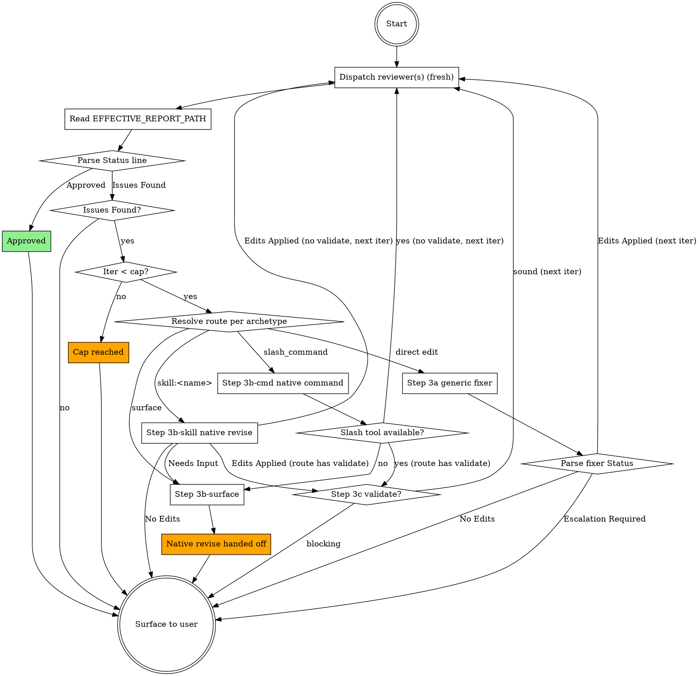

## Your Task

You are the orchestrator running as the `ai-kit-spec-review` skill (invocable via `/ai-kit-spec-review`, by asking to review a spec/plan, or programmatically). You were given one or more document paths. Your job: drive a review-and-fix loop using clean-context subagents (a reviewer, and a rewrite handler chosen by framework), surface the outcome to the user, and never edit the document yourself.

## Inputs

- **Document path(s):** taken from the user's invocation arguments. If absent, ask the user for absolute paths and stop.
- **Codebase root:** the worktree that contains the document — resolved in Step 0.1, **not** assumed to be your CWD. With worktrees, the spec/plan and the code it grounds against live in a checkout that is often *not* where you were invoked.
- **Flags (optional, parsed from the same invocation arguments):**
  `--cross-ai` (default) or `--no-cross-ai` — whether Step 0.7 attempts
  cross-AI reviewer resolution at all. `--source-vendor=<vendor>` (default
  `anthropic`) — the document's authoring vendor, used by Step 0.7's
  ladder walk to prefer an independent perspective. The default is meant
  to mean "the current session's own vendor"; `anthropic` is that
  default's concrete value here specifically because this orchestrator
  has no runtime introspection API telling it what vendor its own model
  actually is — it can only assume the overwhelmingly common case (a
  native Claude Code session). A session pointed at a compatible
  third-party endpoint would make this default wrong, which is exactly
  the escape hatch `--source-vendor` itself exists for — pass the real
  vendor explicitly in that case. This is a
  **vendor** (`anthropic`, `openai`, `xai`, ...), matching the `vendor`
  field in `review-spec.toml` reviewer entries — not a model id, since
  deriving a vendor from an arbitrary model-id string has no sanctioned
  mapping (model names churn too fast to hardcode a lookup table).

## Step 0 — Persist before dispatch (ALWAYS)

Before any subagent dispatch, every document under review **must exist on disk** at a stable path. Subagents run in isolated contexts and read inputs via the `Read` tool; an in-memory document does not survive the dispatch boundary, and the next iteration would re-read the unfixed file and contradict itself.

| Caller state | Action |
|---|---|
| User passed real file path(s) that exist on disk | Continue to Step 1. |
| Doc was just produced in this session by `brainstorming` / `writing-plans` and SAVED to a path | Confirm the file exists on disk via a `Read` call before Step 1. Do not assume. |
| Doc only exists in chat (in-memory, not yet persisted) | STOP. Tell the user: "The document is not on disk. To run `/ai-kit-spec-review` I need to persist it first to a stable path." Offer a default location appropriate to the framework in use (superpowers → `docs/superpowers/specs/YYYY-MM-DD-<topic>-design.md` or `.../plans/YYYY-MM-DD-<feature>.md`; Spec Kit → `specs/<NNN>-<feature>/spec.md` or `plan.md`; OpenSpec → `openspec/changes/<id>/proposal.md` or `tasks.md`; otherwise ask). After the user confirms, write the document verbatim to the chosen path, then continue. |
| Path was given but file does not exist | STOP. Surface a Failure: `Path does not exist: <path>. Persist the document first.` |

Do not paraphrase the document into the subagent prompt as a workaround — that defeats the clean-context guarantee. The subagent must `Read` the file from disk.

## Step 0.1 — Resolve the codebase root (worktree-aware)

Plans and designs are routinely written/executed in an **isolated worktree** (superpowers
`using-git-worktrees` puts them under `.worktrees/<name>/`, `worktrees/`, or a sibling `../<name>/`),
while you may have been invoked from the main checkout. A clean-context subagent has no way to know
this — if you hand it the wrong root, its codebase-grounding checks read the *main* branch's files
instead of the worktree's, producing phantom "X doesn't exist / contradicts the code" findings (or
silently passing real ones). The root **must be the worktree that owns the document**, derived from
the document's own location:

1. **Derive from the doc, not CWD.** For the first document path, take its directory and run
   `git -C "<doc-dir>" rev-parse --show-toplevel`. That toplevel is the authoritative codebase root —
   it resolves to whichever worktree the file physically lives in. Use it as `<CODEBASE_ROOT>`.
2. **If that fails or feels ambiguous** (doc outside any repo, multiple docs in different roots, or
   you're unsure which checkout is "live"), run `git -C "<doc-dir>" worktree list` and inspect the
   output: each line is `<path>  <sha>  [<branch>]`. Match the document's path prefix to a worktree
   `<path>`; that path is the root. If several docs map to *different* worktrees, that's a red flag —
   stop and ask the user which checkout to ground against (do not silently pick one).
3. **Pass the resolved worktree root** as `<CODEBASE_ROOT>` to **both** the reviewer and the fixer.
   Never default to your CWD or the main repo root when the document lives in a worktree.

**The plan's declared paths win — do not normalize them to convention.** A plan may
deliberately declare a worktree/target outside the ambient convention (e.g. a cross-repo
execution that creates `../.worktrees/target-repo/<wt>` even though `CLAUDE.md` /
`CLAUDE.local.md` recommend `.claude/worktrees/`). For *this* review, authority runs:
**(1) the explicit paths in the plan/spec under review → (2) `CLAUDE.local.md` → `CLAUDE.md`
→ (3) Claude's default recommendation.** The reviewer grounds against the paths the plan
declares, AS DECLARED; it must not flag them merely for diverging from convention, and must
not "correct" them toward `.claude/worktrees`. Carry this precedence into the reviewer prompt.

**Cross-repo plans have more than one root.** If the document references files in a second
repo/worktree (a target repo it acts on), don't force a single `--show-toplevel`. Capture each
**declared** root from the plan, label which references belong to which root, and pass the set
so the reviewer grounds each claim against the right checkout instead of chasing references
across both. If the roots are unclear, run `git worktree list` in each repo and ask once.

Record the result as `CODEBASE_ROOT` (one root, or a labeled set for cross-repo plans).

## Step 0.5 — Detect framework, resolve its profile, classify archetype

The reviewer/fixer are clean-context subagents — give them the framework's rules as a **file
path**, not prose. You (orchestrator, in the user's session, with web access) do the detection
and any research; they just `Read` the profile. Three sub-steps:

First resolve `SEEDS_DIR` and `CACHE_DIR` to absolute paths (see Constants) — every profile path
below and the `FRAMEWORK_PROFILE_PATH` you pass to subagents must be absolute, never a bare
relative `references/frameworks/…`.

**A. Detect the framework.** Match the document path + nearby project markers against the
`detection_signals` of the known profiles (bundled seeds in `SEEDS_DIR`). Conversation signal
wins: if the user just used a framework's skill (superpowers `brainstorming`/`writing-plans` →
`superpowers`), use it. If markers are ambiguous, ask once.

**B. Resolve the profile** (an **absolute** path on disk), in order:
1. `CACHE_DIR/<id>.md` if it exists and isn't stale → use it.
2. else the bundled seed `SEEDS_DIR/<id>.md` → use it.
3. else **unknown framework** → research it (web: official repo/docs), write a new profile to
   `CACHE_DIR/<id>.md` following `SEEDS_DIR/SCHEMA.md` (frontmatter + conventions), set
   `last_updated` to today, then use it. Tell the user one line: "Learned framework `<id>`;
   cached its profile."

Staleness: a cached profile for a known-to-drift framework (`bmad`, `gsd`) older than ~180 days
is a refresh candidate — you may re-research and rewrite the **cache** copy (bump
`last_updated`). Never overwrite a bundled seed in place. Record the resolved path as
`FRAMEWORK_PROFILE_PATH` (or `none` if you genuinely can't resolve a framework, e.g. generic
`docs/rfcs/` — the reviewer then uses generic checklists).

**C. Classify the archetype** from the resolved profile's `doc_types` (glob → archetype).
Conversation signal still wins (`brainstorming` → a fused `intent+requirements+design` design
doc; `writing-plans` → `plan`). A `fused` doc yields several archetypes — pass them all. If the
path matches no `doc_types` glob, fall back to content shape (see the reviewer skill's archetype
table) or ask. Record as `ARCHETYPE` (one or more of: `intent`, `requirements`, `design`, `plan`).

**Low-confidence detection → generic.** If the framework stays ambiguous and the user cannot
disambiguate, set `FRAMEWORK_PROFILE_PATH = none` and route every archetype through the generic
`ai-kit-spec-review-fixer` fixer (Step 3a). State this in the final Surface message ("Framework
ambiguous — used the generic fixer.") so routing stays transparent.

Pass both `FRAMEWORK_PROFILE_PATH` and `ARCHETYPE` to the reviewer and fixer below.

## Step 0.6 — Scope the review to the project's lifecycle stage

Frameworks have stages (GSD: context/discussion → requirements → roadmap → research → plan →
status; OpenSpec: proposal → design → specs → tasks; superpowers: design → plan). Reviewing an
early-stage document as if it were a finished plan is the most common failure — e.g. invoked in
GSD with only `PROJECT.md`/CONTEXT present, the reviewer demands tasks and exact files that the
*intent* stage does not have yet. Don't. Resolve scope before dispatch:

1. **See what exists.** Glob the profile's `doc_types` against the project root. The
   furthest-along present archetype (per the profile's `lifecycle_order`) is the **current
   stage**.
2. **Review each existing document at its own archetype** — the `ARCHETYPE` from Step 0.5 is
   per-document and is the ceiling. Never escalate an upstream doc to a downstream checklist:
   a bare `intent`/CONTEXT is judged on why/what clarity and scope, **not** on missing tasks,
   files, or interfaces. (The reviewer skill enforces this too; set the right `ARCHETYPE` so it
   never has to guess.)
3. **Missing required prerequisites are gaps, not defects.** A `required: true` doc-type absent
   at or before the current stage → note it to the user as a prerequisite to produce next, not
   as a finding inside an existing document.
4. **Insufficient-info guard.** If the user asked to review an artifact a later stage hasn't
   produced (e.g. "review the plan" but only `intent` exists), STOP and surface:
   `Only <existing docs> exist; the project is at the <stage> stage. There is no <requested
   archetype> to review yet. I can review <existing> as <archetype>, or wait until <next
   stage> is produced.` Do not invent a deeper review or ask for downstream detail.

When the user passed explicit path(s), review exactly those at their archetypes — do not pull
in downstream scope. When the user passed none ("review my specs"), review every existing doc
at its archetype and list the gaps.

5. **Supply complementary grounding to the reviewer.** A document under review is usually
   derived from upstream context the reviewer should read but NOT review. When reviewing a
   `plan` (or `design`), gather the framework's sibling context/research for that same unit of
   work and pass them as `GROUNDING_DOCS` (Step 1): for GSD, the phase's `NN-CONTEXT.md`
   (intent) and `NN-RESEARCH.md` (research) — plus `NN-PATTERNS.md`/`NN-UI-SPEC.md` if present —
   from the same `.planning/phases/<phase>/` dir; for superpowers, the sibling `*-design.md` for
   a plan. The reviewer grounds the document against these to catch drift (plan contradicts its
   own intent/research) but emits **no findings about the grounding docs themselves**. Context/
   state archetypes (`state`, discussion logs, verification, summaries) are grounding-only, never
   reviewed. If no sibling context exists, pass `none`.

## Step 0.7 — Resolve the reviewer list (cross-AI)

Runs once per invocation, after Step 0.6. Before resolving the reviewer list, ask: is cross-AI support actually installed and requested, or should this degrade cleanly to native-only?

0. Resolve `TOOLS_PY` and `CHECKLIST_SKILL_MD`. **`ai-kit-spec.py` lives
   inside `skills/ai-kit-spec-review/` itself** (not at a top-level `tools/` —
   that placement isn't reachable from an installed skill, since
   `tools/setup.py`'s symlinks only cover `agents/commands/skills`, per
   its `CATEGORIES`). Because it's inside `ai-kit-spec-review`'s own skill
   directory, it resolves the same way `SEEDS_DIR` (in the `## Constants`
   section, below this Step 0.7 insertion point) does (three
   candidates: `CLAUDE_PLUGIN_ROOT`/`~/.claude/skills`/
   sibling-of-this-file) — this snippet is **self-contained** and does
   not read any variable assigned elsewhere; it computes its own
   directory inline via `$(dirname ...)`. (`SEEDS_DIR`'s own block below
   assigns `SKILL_DIR="$(dirname "<path to this SKILL.md>")"` immediately
   before its own `for` loop, so its third candidate resolves the same
   way this snippet's does.):
   ```bash
   for d in "${CLAUDE_PLUGIN_ROOT:+$CLAUDE_PLUGIN_ROOT/skills/ai-kit-spec-review}" \
            "$HOME/.claude/skills/ai-kit-spec-review" \
            "$(dirname "<absolute path to THIS SKILL.md>")"; do
     [ -d "$d" ] && { REVIEW_SPEC_SKILL_DIR="$d"; break; }
   done
   TOOLS_PY="$REVIEW_SPEC_SKILL_DIR/ai-kit-spec.py"
   CHECKLIST_SKILL_MD="$(dirname "$REVIEW_SPEC_SKILL_DIR")/ai-kit-spec-review-checklist/SKILL.md"
   if [ -f "$TOOLS_PY" ]; then
     RUNTIMES_JSON="$(python3 "$TOOLS_PY" cache-path --kind runtimes)"
     QUOTA_JSON="$(python3 "$TOOLS_PY" cache-path --kind quota)"
   fi
   SHARED_TOOLING_PATH="$REVIEW_SPEC_SKILL_DIR/references/tooling-guidance.md"
   printf '%s\n' "$TOOLS_PY" "$CHECKLIST_SKILL_MD" "$RUNTIMES_JSON" "$QUOTA_JSON" "$SHARED_TOOLING_PATH"
   ```
   `CHECKLIST_SKILL_MD` is the path Step 1's external-CLI dispatch tells
   the external reviewer to `Read` — `ai-kit-spec-review-checklist` (the
   reviewer skill) is always installed as
   `ai-kit-spec-review`'s own sibling, since both live under the same `skills/`
   tree in every installed shape (plugin, `~/.claude/skills`, or a dev
   checkout), so deriving it from `$REVIEW_SPEC_SKILL_DIR`'s own parent
   needs no separate three-candidate search. `cache-path`
   resolves `RUNTIMES_JSON`/`QUOTA_JSON` through the module's own
   `cache_runtimes_path`/`cache_quota_path` — the
   `${XDG_CACHE_HOME:-$HOME/.cache}/ai-kit/ai-kit-spec-review/...` formula lives
   in exactly one place, not duplicated as a bash literal here.
   Resolve this whole block once, in one `Bash` call, and — exactly like
   `RUN_TMP_DIR` below — record `TOOLS_PY`/`CHECKLIST_SKILL_MD`/
   `RUNTIMES_JSON`/`QUOTA_JSON`/`SHARED_TOOLING_PATH` from the trailing
   `printf`'s stdout (five lines, in that order) as literal absolute paths
   substituted into every later command and prose reference; they are
   **not** shell environment variables that survive across separate `Bash`
   tool calls. If
   `TOOLS_PY` does not exist at the resolved path, treat this
   exactly like `--no-cross-ai` (point 2 below) — cross-AI support isn't
   installed, never block the review over it. If `TOOLS_PY` exists but
   `CHECKLIST_SKILL_MD` does not (a broken/partial install —
   `ai-kit-spec-review-checklist` missing while `ai-kit-spec-review` itself is
   present), still proceed with native dispatch (`cli` absent entries
   need no checklist path), but skip any reviewer entry whose `cli` is
   set: an external CLI can't be told to `Read` a file that doesn't
   exist, so treat that entry the way a config error is treated —
   dropped from `REVIEWER_LIST`, never dispatched, and this iteration
   surfaces via whatever entries remain (or `NO_CONFIG_FALLBACK` if none
   do).

   Also call `detect-tools`, cached the same way `ai-kit-spec-config`'s own
   Step 1 does it — but since this orchestrator has no long-lived cache
   file for tool availability today, call it fresh each run (cheap — a
   handful of `which` calls, no network, no TTL logic needed):
   ```bash
   TOOL_AVAILABILITY_JSON="$(python3 "$TOOLS_PY" detect-tools)"
   ```
   Record `TOOL_AVAILABILITY_JSON` as this run's literal tool-availability
   JSON string, substituted into every later `--tool-availability-json`
   reference.
1. Run `mktemp -d` via `Bash`, and record its printed absolute path as
   `RUN_TMP_DIR` in this skill's own working notes — **not** a shell
   environment variable. Every `Bash` tool call in this harness starts a
   fresh shell, so a variable set in one call is gone by the next one;
   from here on, substitute `RUN_TMP_DIR`'s literal absolute path into
   every command and every prose reference below, exactly the way
   `CODEBASE_ROOT` is already resolved once (Step 0.1) and substituted
   literally everywhere after. (This doc keeps writing `$RUN_TMP_DIR` for
   readability, matching how `<CODEBASE_ROOT>` reads elsewhere in this
   skill — read every `$RUN_TMP_DIR` below as "the literal path captured
   here", never as an actual shell variable reference.) Every artifact
   this run produces (raw reviewer reports, the double-review merge, the
   fixer's report) lives under this one directory, replacing the old flat
   `/tmp/ai-kit-spec-review-*` paths (which collided across concurrent runs on
   different projects/worktrees — fixed here).
2. **If `--no-cross-ai` was requested (or `TOOLS_PY` is missing, point 0
   above)**: set `REVIEWER_LIST` directly, in-context, to the single-entry
   array `[{"key": "session-default", "model": "", "vendor": "", "cli":
   null, "command": null, "extra": {}}]` — `ai-kit-spec.py`'s
   `NO_CONFIG_FALLBACK` constant's exact shape. **Do not run
   `resolve-reviewers`, `probe-quota`, or
   `detect-runtimes`, and do not write `$RUN_TMP_DIR/reviewers.json`** —
   points 3–5 below are entirely skipped, not just their side effects;
   this is the "skip it entirely, minimal overhead" case the flag exists
   for. Because this entry's `cli` is always `null`, Step 1's dispatch
   never needs `reviewers.json` for it either (only the external branch
   reads that file), so nothing downstream is left dangling. Go directly
   to Step 1.
3. **Required — check before the call below, not optionally**: the
   `--if-stale` call immediately after this destroys the evidence a
   missing-file check would find (it creates the file), so this order is
   fixed — check first, save second:
   ```bash
   [ -f "$RUNTIMES_JSON" ] || echo "no-runtimes-snapshot-yet"
   ```
   Then refresh the runtimes snapshot if it's missing or older than
   `RUNTIMES_TTL_SECONDS` (~30 days — CLI/model presence rarely changes):
   ```bash
   python3 "$TOOLS_PY" detect-runtimes --if-stale "$RUNTIMES_JSON"
   ```
   `--if-stale` checks `cache_is_stale` itself and no-ops
   (prints `{}`, doesn't touch the file) when the existing snapshot is
   still fresh; when missing or stale it detects and saves in the same
   call, so this is always safe to run. If the check above printed
   `no-runtimes-snapshot-yet` (this was the first-ever save), print one
   line — "No cross-AI config saved yet — run `ai-kit-spec-config` so
   this doesn't repeat every invocation." — then continue to step 4
   regardless; do NOT skip reviewer resolution (there's usually no
   `review-spec.toml` yet either, so `resolve-reviewers` in step 5
   degrades to `NO_CONFIG_FALLBACK` on its own — no special-casing needed
   here beyond the detection call and the hint).
4. Refresh quota for anything the config's ladder might need. `--cwd`
   takes exactly one directory — when Step 0.1 recorded `CODEBASE_ROOT`
   as a labeled set (cross-repo plans), use the root that owns the
   primary document under review (the first entry in `<DOC_PATHS>`); the
   same rule applies to `resolve-reviewers` at point 5 below:
   ```bash
   python3 "$TOOLS_PY" probe-quota --cwd <CODEBASE_ROOT> \
     --quota-path "$QUOTA_JSON"
   ```
   (No-op — writes `{}` — when there is no config/ladder to probe.)
5. Resolve the reviewer list, saving its output to a file (Step 1's
   external dispatch needs a stable path to feed `dispatch-reviewer`,
   not just the in-context text). This point is only reached when cross-AI is
   actually active — `--no-cross-ai` already short-circuited at step 2
   above — so `--cross-ai` is always passed here, never conditionally.
   (Do not split this command across a trailing `\` followed by an
   inline `#` comment — that escapes the *space* before the comment, not
   the newline, so the redirect below silently becomes a separate command
   that truncates the file.):
   ```bash
   python3 "$TOOLS_PY" resolve-reviewers \
     --cwd <CODEBASE_ROOT> \
     --quota-path "$QUOTA_JSON" \
     --source-vendor <SOURCE_VENDOR from the "## Inputs" section's flag parsing> \
     --cross-ai \
     > "$RUN_TMP_DIR/reviewers.json"
   ```
   `resolve-reviewers` itself calls `cfg_resolve(cwd, env)`,
   which already handles the local-vs-global/`strategy` resolution — this
   step never re-implements that logic, it only picks which `--cwd` to
   pass (`CODEBASE_ROOT` from Step 0.1, so the resolved local config is
   the one that actually owns the document under review — when
   `CODEBASE_ROOT` is a labeled set, that means the root of `<DOC_PATHS>`'s
   first entry, same rule as point 4 above).
6. **(Active cross-AI path only — point 2's degraded path already set
   `REVIEWER_LIST` directly and skipped straight to Step 1.)**
   `$RUN_TMP_DIR/reviewers.json` holds a JSON array of 1 or 2 reviewer
   objects. Record its contents as `REVIEWER_LIST` (index 0 = primary/only
   reviewer, index 1 = the secondary in double mode) — Step 1 both reasons
   over this in-context and passes the same file's path (plus the entry's
   index) to `dispatch-reviewer` for external dispatch.

## Constants

- **Reviewer skill:** `ai-kit-spec-review-checklist`
- **Fixer skill:** `ai-kit-spec-review-fixer`
- **Subagent type for both:** `general-purpose`
- **Fixer subagent model:** `sonnet` (Haiku misses subtle defects; Opus burns tokens for no extra fix-quality signal — the fixer stays Claude-only and sonnet-pinned; who edits the document under review is out of scope for this skill). The reviewer's model is no longer a Constant at all — it comes from `REVIEWER_LIST` (this skill's own `Step 0.7`, points 2/5/6), set per-entry.
- **Iteration cap:** 3 (configurable per invocation if user requests)
- **Loop state file (optional):** `$RUN_TMP_DIR/loop.log` — append iter# + status line each round, for debugging only.
- **Framework profile seeds dir** (`SEEDS_DIR`) — resolve once to an **absolute** path. As a skill
  you are not guaranteed a `CLAUDE_PLUGIN_ROOT`; take the **first existing** of, in order:
  1. `${CLAUDE_PLUGIN_ROOT}/skills/ai-kit-spec-review-checklist/references/frameworks/` (when set)
  2. `~/.claude/skills/ai-kit-spec-review-checklist/references/frameworks/` (symlinked install — what `tools/install.sh` creates)
  3. the sibling of this skill: `<dir-of-this-SKILL.md>/../ai-kit-spec-review-checklist/references/frameworks/`

  ```bash
  # SKILL_DIR = the directory containing this SKILL.md (the ai-kit-spec-review skill)
  SKILL_DIR="$(dirname "<absolute path to THIS SKILL.md>")"
  for d in "${CLAUDE_PLUGIN_ROOT:+$CLAUDE_PLUGIN_ROOT/skills/ai-kit-spec-review-checklist/references/frameworks}" \
           "$HOME/.claude/skills/ai-kit-spec-review-checklist/references/frameworks" \
           "$SKILL_DIR/../ai-kit-spec-review-checklist/references/frameworks"; do
    [ -d "$d" ] && { SEEDS_DIR="$d"; break; }
  done
  ```
  If none of the three fallbacks resolves to an existing directory, STOP and surface to the user: `The ai-kit-spec-review-checklist skill is not installed (no framework profiles found). Install ai-kit and re-invoke.` — do not invent a path or proceed.

  It holds the curated seed profiles `<id>.md` and `SCHEMA.md`. **Never reference these as a bare
  relative `references/frameworks/…`** — your CWD is the user's repo (often a worktree), not the kit.
- **Framework profile cache** (`CACHE_DIR`): `~/.claude/cache/framework-profiles/*.md` (absolute,
  user-global) — learned/refreshed profiles the orchestrator writes for frameworks not covered by a
  seed. Create the dir on first write.

## NEVER (hard landmines)

These are the failures that have actually bitten this loop. Violating any one silently corrupts the review:

- **NEVER dispatch any subagent before every document under review is saved on disk** (Step 0). Subagents read via `Read`; an in-memory doc does not survive the dispatch boundary.
- **NEVER run the generic fixer before `EFFECTIVE_REPORT_PATH` exists on disk** (Step 1.5). The fixer has nothing to `Read` otherwise.
- **NEVER paraphrase the document (or prior reports, or the conversation) into a subagent prompt** as a workaround — pass paths only. Inlining defeats the clean-context guarantee.
- **NEVER default `CODEBASE_ROOT` to your CWD.** Always derive it from the document's own worktree via `git` (Step 0.1); the wrong checkout yields phantom findings.
- **NEVER edit the document yourself, and never reuse a subagent across iterations.** Orchestrator is dispatch + parse; a fresh subagent each round keeps the audit clean.

The `## Hard rules for the orchestrator` table near the end carries the full list with reasons.

## Loop

Run this loop. Each iteration is one reviewer dispatch followed by (conditionally) one fixer dispatch.



### Step 1 — Dispatch reviewer(s) (every iteration)

For each entry in `REVIEWER_LIST`:

- **`cli` is `null`** (native dispatch): use the `Agent` tool exactly as
  before —
  - `subagent_type`: `general-purpose`
  - `model`: the entry's `model`, **omitted entirely when `model == ""`**
    (the `NO_CONFIG_FALLBACK`/session-default case — never substitute a
    hardcoded name here; an empty `model` means "let the `Agent` tool use
    its own default"). A non-empty `model` value here **must be one of the
    four `Agent`-tool model aliases** (`sonnet`/`opus`/`haiku`/`fable` —
    Claude Code's `Agent` tool does not accept a full model id like
    `"opus-5"`); `ai-kit-spec-config` is responsible for writing
    exactly one of these four strings for every native reviewer entry, so
    surface anything else as a config error rather than passing it through.
  - `description`: `ai-kit-spec-review iter N reviewer (<key>)`
  - `prompt`: the template below, invoking the `ai-kit-spec-review-checklist` skill
  - After the `Agent` tool returns its report text, write it verbatim to
    `$RUN_TMP_DIR/iter<N>-<key>.md` via the `Write` tool (mirroring the
    external branch below, which redirects `Bash` stdout to the same
    path). Step 1.5's merge reads both reviewers' reports from files
    unconditionally — a native reviewer's report must land on disk exactly
    like an external one's, or `merge-reports` has no file to
    open for it and crashes the loop the first time `policy.mode =
    "double"` actually runs.

- **`cli` is set** (external CLI dispatch):
  1. Write the prompt text below to `$RUN_TMP_DIR/iter<N>-<key>-prompt.txt`
     via the `Write` tool, with `{prompt}` filled in as:

     ```
     Read the file at <CHECKLIST_SKILL_MD (Step 0.7 point 0)>
     and follow it exactly, substituting:
     - ARCHETYPE = <ARCHETYPE>
     - FRAMEWORK_PROFILE_PATH = <FRAMEWORK_PROFILE_PATH>
     Read every file under review fresh from disk: <DOC_PATHS>
     Complementary grounding documents (Read for context — DO NOT review,
     score, or emit findings about these): <GROUNDING_DOCS>
     These are the upstream context/research the document under review is
     derived from. Use them to detect drift — where the document under
     review contradicts or omits what its own intent/research established —
     and fold that into findings about the REVIEWED document only. If
     "none", there are none.
     Codebase root(s) for grounding: <CODEBASE_ROOT>
     The paths the document itself declares (worktree/target locations,
     cross-repo references) are AUTHORITATIVE for this review — do not flag
     them or "correct" them just because they differ from CLAUDE.md /
     .claude/worktrees convention; only flag a path if it's internally
     inconsistent or violates a hard constraint.
     ARCHETYPE is the ceiling per document: judge an upstream doc (e.g.
     intent) only at its own level — never demand downstream detail
     (tasks, exact files, interfaces) it isn't meant to have.
     Emit the report following that skill's Output template strictly, ending
     with the ### Status: line. Do not edit any file under review.
     ```

     (External CLIs can't call our `Skill` tool, but they can read a file
     path — this keeps `ai-kit-spec-review-checklist` the single source of truth
     for the checklist instead of duplicating its content into every
     CLI's prompt. The substitutions and rules above mirror the native
     template's `<GROUNDING_DOCS>`, declared-paths-authoritative, and
     ARCHETYPE-ceiling clauses verbatim — see the native reviewer prompt
     template later in this same Step 1 — so an external reviewer works
     from the exact same contract a native one does, not a thinner one.)
  2. Resolve this entry's timeout tiers via the `resolve-timeout-tiers` subcommand (the entry's
     own flat `timeout_tiers` key if `$RUN_TMP_DIR/reviewers.json`'s entry at this index has
     one, else the config's own `policy.timeout_tiers`):
     ```bash
     TIMEOUT_TIERS="$(python3 "$TOOLS_PY" resolve-timeout-tiers --cwd <CODEBASE_ROOT> \
       --reviewers-json "$RUN_TMP_DIR/reviewers.json" --index <0 for primary, 1 for secondary>)"
     ```
  3. Dispatch via `dispatch-reviewer` — **one** call, no separate render step, instead of a
     hand-built `nohup`/redirect pipeline. One tested Python path composes the prompt, renders
     the entry's `command` template against it, and runs it; never ad hoc shell assembled fresh
     per run:
     ```bash
     python3 "$TOOLS_PY" dispatch-reviewer \
       --reviewers-json "$RUN_TMP_DIR/reviewers.json" \
       --index <0 for the primary/single reviewer, 1 for the secondary> \
       --prompt-file "$RUN_TMP_DIR/iter<N>-<key>-prompt.txt" \
       --timeout-tiers "$TIMEOUT_TIERS" \
       --tool-availability-json "$TOOL_AVAILABILITY_JSON" \
       --stdout-only \
       > "$RUN_TMP_DIR/iter<N>-<key>.md"
     ```
     **Do not render the command yourself and pass it back in.** `dispatch-reviewer` takes the
     reviewer entry (`--reviewers-json` + `--index`), not a pre-rendered command string, and
     calls `render_reviewer_command` internally *after* it has prefixed the tooling guidance
     onto the prompt. That ordering is load-bearing twice over: some CLIs (grok) inline the
     prompt into their own command line via `{prompt}` rather than reading stdin, so guidance
     composed after the render would never reach them; and a rendered command round-tripped
     back through a `--command "<string>"` shell argument would be shell-evaluated twice,
     reintroducing the `$`/backtick injection hazard `render_reviewer_command`'s escaping
     exists to prevent. There is likewise **no** `--codegraph-registered` flag to compute:
     `dispatch-reviewer` runs the same live `check_codegraph_mcp_healthy` check itself whenever
     the entry has a `cli` (the same internal-resolution pattern the execute family's
     `prepare-tooling` already uses), so the orchestrator never has to evaluate it.
     `$SHARED_TOOLING_PATH` (resolved in Step 0.7) and `$TOOL_AVAILABILITY_JSON` are surfaced
     to the reviewer as named `SHARED_TOOLING_PATH = …` / `TOOL_AVAILABILITY = …` lines at the
     top of the composed prompt.

     **Run this backgrounded or with an explicit near-cap `Bash` timeout — never on the default
     one.** The tiers are cumulative, not a ceiling: the default `[600, 1200, 1800]` is up to
     **60 minutes** of wall time in the worst case, and tier 1 alone (600s) already equals the
     harness's own 600000ms maximum. A short default timeout kills the dispatch mid-tier and
     throws away work that was still running. Either run the command with `run_in_background`
     and then poll for `$RUN_TMP_DIR/iter<N>-<key>.md` to exist and stop growing before moving
     on to Step 1.5, or (for a config whose tiers you know are short) pass an explicit
     `timeout` close to the harness cap. Treat a dispatch that never produces the report file
     exactly like a nonzero exit below — the file is absent, so the fail-closed rules apply
     unchanged.

     **If this exits nonzero** (a malformed or missing `command` template on this reviewer
     entry, or an empty `timeout_tiers` — config errors, not runtime failures), this reviewer's
     slot failed to dispatch. Do not write or keep `$RUN_TMP_DIR/iter<N>-<key>.md` for it —
     leaving it absent is what makes Step 1.5's `merge-reports` (double mode) or the
     missing-file case (single mode) fail closed through the existing `### Status:`-line-based
     rules, with no new special-casing needed here.

Reviewer prompt template — use VERBATIM, substitute only `<DOC_PATHS>`, `<ARCHETYPE>`, `<FRAMEWORK_PROFILE_PATH>`, `<CODEBASE_ROOT>`, `<GROUNDING_DOCS>`, `<SHARED_TOOLING_PATH>`, and `<TOOL_AVAILABILITY_JSON>` (both resolved in Step 0.7 point 0):

```
You are the reviewer.

Step 1: Invoke the Skill tool with skill name "ai-kit-spec-review-checklist" and follow it exactly.

Step 2: The orchestrator has pre-resolved:
- ARCHETYPE = <ARCHETYPE>  (one or more of: intent, requirements, design, plan)
- FRAMEWORK_PROFILE_PATH = <FRAMEWORK_PROFILE_PATH>  (a file path on disk, or "none")
Trust these — the orchestrator has project context you don't; skip the skill's own
detection/classification. If FRAMEWORK_PROFILE_PATH is a path, Read it: it encodes this
framework's doc archetypes and review conventions (requirement syntax, delta sections,
ambiguity/parallel markers, constitutional gates) — apply them. If "none", use the generic
archetype checklists.

Step 2b: The orchestrator has also pre-resolved this machine's tooling facts:
- SHARED_TOOLING_PATH = <SHARED_TOOLING_PATH>
- TOOL_AVAILABILITY = <TOOL_AVAILABILITY_JSON>
Read SHARED_TOOLING_PATH for this repo's confirmed tool preferences and apply them during your
own grounding work (prefer rg/fd/bat/sd/eza and codegraph_explore where confirmed available,
over broad reads/legacy tools). TOOL_AVAILABILITY is the authoritative map of which of those
tools are actually installed here — it is what the checklist's legacy-tool-usage rule is gated
on, so never flag a legacy invocation whose modern replacement is not `true` in it.

Step 3: Read every file under review fresh from disk:
<DOC_PATHS>

Step 3b: Complementary grounding documents (Read for context — DO NOT review, score, or emit
findings about these): <GROUNDING_DOCS>
These are the upstream context/research the document under review is derived from (e.g. a GSD
phase's CONTEXT/RESEARCH, or a superpowers design doc behind a plan). Use them to detect drift —
where the document under review contradicts or omits what its own intent/research established —
and fold that into findings about the REVIEWED document only. If "none", there are none.

Step 4: Codebase root(s) for grounding checks: <CODEBASE_ROOT>
Ground claims against these root(s). The paths the document itself declares (worktree/target
locations, cross-repo references) are AUTHORITATIVE for this review — do not flag them or
"correct" them just because they differ from CLAUDE.md / .claude/worktrees convention; only
flag a path if it's internally inconsistent or violates a hard constraint. For cross-repo
input, ground each reference against the root it belongs to; don't chase references across
repos.

Step 5: Apply the checklist for each ARCHETYPE (Intent / Requirements / Design / Plan), plus
the framework conventions from the profile, plus Cross-Document Consistency if multiple files.
ARCHETYPE is the ceiling per document: judge an upstream doc (e.g. intent) only at its own
level — never demand downstream detail (tasks, exact files, interfaces) it isn't meant to have.

Step 6: Emit the report following the skill's output template strictly. Record `<framework> ·
<archetype(s)>` on the `### Document Type` line. End with the `### Status:` line.

Do not assume any context outside what you read. Do not edit any file under review.
```

**CRITICAL:** never include the document content, prior reports, the conversation, or the author's intent in the reviewer prompt. Paths only.

### Step 1.5 — Merge reviewer reports, then bind `EFFECTIVE_REPORT_PATH` (runs every iteration — only the merge call itself is conditional)

**This whole step always runs, in both the 1- and 2-reviewer cases** —
only the `merge-reports` `Bash` call below is conditional on
`REVIEWER_LIST` having 2 entries. Do not skip this step for a
single-reviewer iteration: `EFFECTIVE_REPORT_PATH` is bound here either
way, and Step 2/3a/3b below have no other source for it.

When `REVIEWER_LIST` has 2 entries, run:

```bash
python3 "$TOOLS_PY" merge-reports --doc-paths "<DOC_PATHS>" \
  "<key1>=$RUN_TMP_DIR/iter<N>-<key1>.md" \
  "<key2>=$RUN_TMP_DIR/iter<N>-<key2>.md" \
  > "$RUN_TMP_DIR/iter<N>-merged.md"
```

Record `EFFECTIVE_REPORT_PATH`: `$RUN_TMP_DIR/iter<N>-merged.md` when
`REVIEWER_LIST` had 2 entries, else `$RUN_TMP_DIR/iter<N>-<key>.md` (the
single reviewer's own raw report) when it had 1. **Every later step reads
`EFFECTIVE_REPORT_PATH` and only that name** — there is exactly one
report artifact per iteration from Step 1.5 onward, never three or four
different invented filenames for the same underlying thing. The merged
report becomes the input to Step 2 (parse `### Status:`) exactly as a
single reviewer's report would — the merge already reproduces that line
(`Approved` when no findings survived the merge, `Issues Found — fix and
re-invoke` otherwise). When `REVIEWER_LIST` has only 1 entry, skip the
merge call — that entry's raw report (or the native `Agent` tool's output,
written to the same `iter<N>-<key>.md` path per Step 1) is
`EFFECTIVE_REPORT_PATH` directly, unchanged from today's behavior. If
`EFFECTIVE_REPORT_PATH` does not exist on disk at all — the single-mode
case of Step 1's "dispatch-reviewer exits nonzero" dispatch failure, which
deliberately leaves that path unwritten — treat it exactly like a
report that lacks a `### Status:` line: Step 2's existing "No Status
line -> Surface failure" rule applies unchanged, there is no separate
"missing file" case to handle.

### Step 2 — Parse reviewer Status

Read `EFFECTIVE_REPORT_PATH` (Step 1.5) from disk; locate the line beginning `### Status:` in it.

| Status | Action |
|---|---|
| `### Status: Approved` | Loop ends. Go to Surface (success). |
| `### Status: Issues Found — fix and re-invoke` | Continue to Step 3 if iter < cap, else go to Surface (cap reached). |
| Any other text on the Status line | Treat as Issues Found (be conservative); log the anomaly. |
| No Status line | Loop ends. Surface failure: "Reviewer did not emit a Status line." |

### Step 3 — Apply findings (when Issues Found, iter < cap)

Resolve a revise route per flagged archetype and dispatch to one of four handlers: 3a (generic fixer for direct edits), 3b-skill (native framework skill), 3b-cmd (slash command), or 3b-surface (hand off to user). Run 3c validation after successful native revise if the route requires it. Before dispatching, ask: which handler does this archetype's `revise_protocol.routes` actually specify — direct edit, a native skill, a slash command, or surface-only?

**MANDATORY — READ ENTIRE FILE**: Before dispatching to any of the four handlers below, read [`references/apply-findings.md`](references/apply-findings.md) completely — it has the exact VERBATIM prompt templates, parsing tables, and sequencing rules for all four routes. Do not attempt to reconstruct these from memory.

Dispatch per the route's `invoke`:

| `invoke` | Handler |
|---|---|
| (direct edit / archetype not covered) | **Step 3a** — generic `ai-kit-spec-review-fixer` fixer |
| `skill:<name>` | **Step 3b-skill** — hybrid native-skill revise; surface if it stalls |
| `slash_command` | **Step 3b-cmd** — invoke it if the command/backing skill is installed this session (e.g. global GSD), else surface |
| `surface` | **Step 3b-surface** — always hand the user the pre-filled command, then stop |

### Step 4 — Parse fixer Status

*(Reached only from Step 3a — the generic direct-edit fixer. The native-revise paths 3b-skill / 3b-cmd parse their own status inline and do not pass through here.)*

Locate the `### Status:` line in the fixer's Fix Summary.

| Status | Action |
|---|---|
| `### Status: Edits Applied` | Increment iter. Go back to Step 1 (re-review with fresh reviewer). |
| `### Status: Escalation Required` | Loop ends. Go to Surface (escalation). |
| `### Status: No Edits` | Loop ends. Go to Surface (escalation — fixer made no progress). |
| No Status line | Loop ends. Surface failure: "Fixer did not emit a Status line." |

### Step 5 — Surface to user

Emit one short message in the user's terminal. Do NOT paste full reports unless the user is at cap or escalation.

| Outcome | Message shape |
|---|---|
| Approved on iter 1 | `Approved on first review. <DOC_PATHS> ready for next step.` |
| Approved after N iters | `Approved after N iteration(s). Doc edited and re-reviewed clean.` |
| Cap reached | `Hit iteration cap (N). Last review still has issues. Final report:\n\n<paste full last reviewer report>\n\nDecide manually.` |
| Escalation Required | `Fixer escalated on iter N. Reason: <fixer's escalation message>. Decide manually.` |
| Native revise handed off | `Findings ready. This <archetype> is owned by <framework>'s planner — run: <pre-filled command>  (findings: <report path>), then re-run /ai-kit-spec-review.` |
| Insufficient info (stage gap) | `Only <existing docs> exist; project is at the <stage> stage. No <requested archetype> to review yet. Reviewed <existing> as <archetype>; produce <next stage> before reviewing it.` |
| Validator blocked (Step 3c) | `Regenerated <archetype> was rejected by <validator> — <reasons>. Findings: <report path>. Fix manually and re-run /ai-kit-spec-review.` |
| Failure | `<failure mode message>. Last available output: <quote brief>.` |

After surfacing, the orchestrator's job is done. Do NOT continue to "next steps" — the user decides whether to invoke `writing-plans`, edit manually, or re-invoke `/ai-kit-spec-review` after their own edits.

## Hard rules for the orchestrator

| Rule | Reason |
|---|---|
| Never edit the document yourself. | Orchestrator is dispatch + parse, not author or fixer. |
| Resolve `CODEBASE_ROOT` from the document's own worktree (Step 0.1), never from your CWD. Use `git worktree list` when unsure. | Grounding the review against the wrong checkout (main vs. the worktree the doc lives in) yields phantom findings and misses real ones. |
| Never include conversation/intent/document-content in subagent prompts. | Subagents must form their own reading from disk. |
| Always dispatch a NEW subagent each iteration. Do not reuse. | Reuse contaminates context with prior round's findings. |
| Reviewer and fixer are separate subagents, never the same. | Fixer must edit; reviewer must not. Separation = audit integrity. |
| Stop at the iteration cap. | Avoid infinite review↔fix loops on irreconcilable disagreement. |
| If reviewer and fixer disagree on a finding's severity across iterations, surface to user. | Orchestrator does not arbitrate. |

## Routing table — who rewrites what

Routing is data-driven from each profile's `revise_protocol.routes`. Seed-profile snapshot (FR-1.5):

| Framework (detected) | Archetype | Rewrite handled by | Mechanism |
|---|---|---|---|
| superpowers | design | `brainstorming` skill | hybrid subagent → surface if it stalls (Step 3b-skill) |
| superpowers | plan | `writing-plans` skill | hybrid subagent → surface if it stalls (Step 3b-skill) |
| GSD | plan | `/gsd-plan-phase {phase_id} --reviews`, then `gsd-plan-checker` | slash-command or surface (3b-cmd) + validate (3c) |
| GSD | intent / requirements / design | `ai-kit-spec-review-fixer` | direct edit (3a) |
| any other framework, generic, or `none` | all | `ai-kit-spec-review-fixer` | direct edit (3a) |
| ambiguous / low-confidence detection | all | `ai-kit-spec-review-fixer` | direct edit (3a) — Surface notes the ambiguity |

The reviewer (`ai-kit-spec-review-checklist`) is identical for every framework; only the **rewrite** stage is
routed. To change routing, edit the framework profile's `revise_protocol.routes` — never hard-code
tools here.

**This table is a convenience snapshot. The authoritative routing is each framework profile's `revise_protocol.routes` — when in doubt, read the profile, not this table.** Adding a framework or changing a route means editing its profile, after which this snapshot may lag.

## Cleanup

After the loop ends (any outcome): `rm -rf "$RUN_TMP_DIR"`. Every artifact
this run produced (reviewer reports, the double-review merge, fixer
reports, the loop log) lives under that one directory — a single command
replaces the old file-by-file `/tmp/ai-kit-spec-review-*` cleanup, and there's
nothing to accidentally miss.
