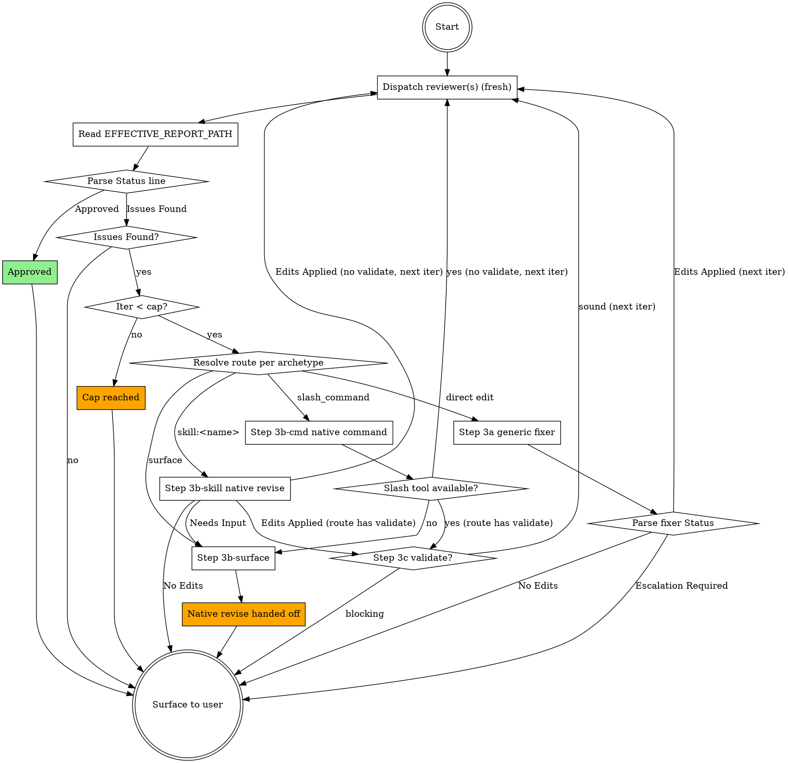

# Loop control-flow diagram

Optional visual companion to the textual Steps 1-5 in SKILL.md, which fully specify the loop's
behavior on their own — this diagram is not needed to execute the loop correctly. Consult it only
if you find the branching in Steps 1-5 hard to trace on a first read (e.g. sorting out how
Step 3's four routes rejoin the main loop, or which paths hit Step 3c validation before returning
to Step 1).

