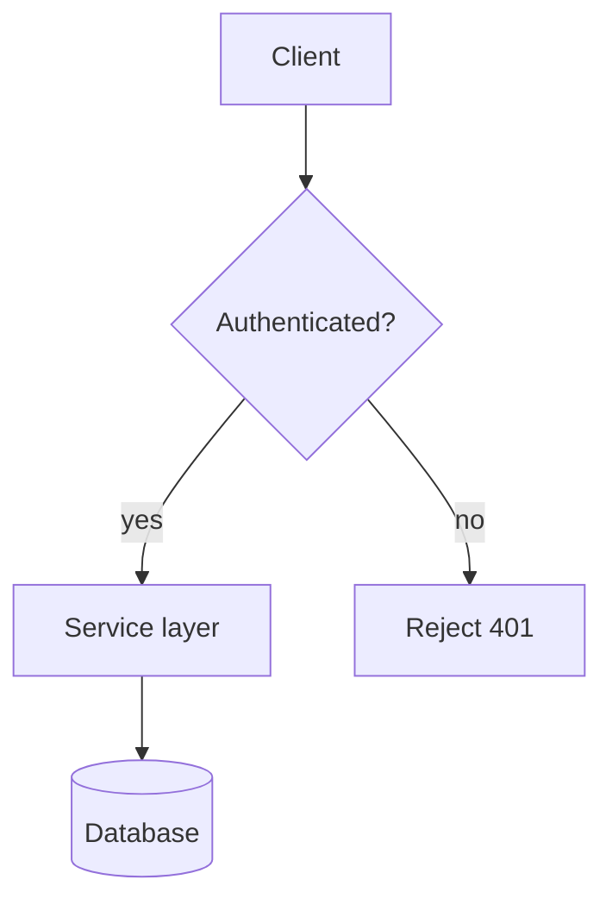

# Quarterly Architecture Review

This sample document exercises the `markdown-to-pdf` skill end to end: prose,
headings, and an embedded mermaid diagram that must be rendered to an image and
embedded in the final PDF.

## Background

The request pipeline routes every inbound call through an authentication gate
before it reaches the service layer. The diagram below shows the happy path.

## Notes

- The source file is never modified; the diagram is rendered into a temporary
  working copy.
- The final PDF is written alongside this file by default.
