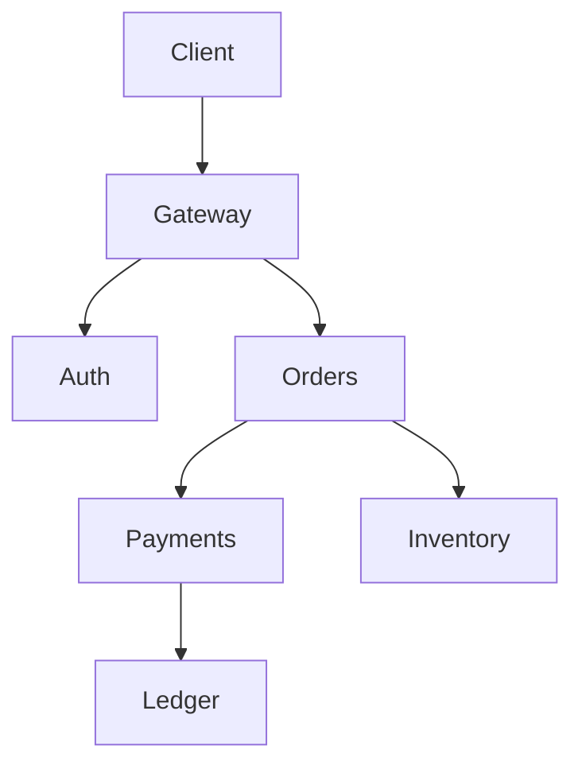

# Fixture 01 — flat gray (violates C1)

```mermaid
flowchart TD
    A[Client] --> B[Gateway]
    B --> C[Auth]
    B --> D[Orders]
    D --> E[Payments]
    E --> F[Ledger]
    D --> G[Inventory]
```
