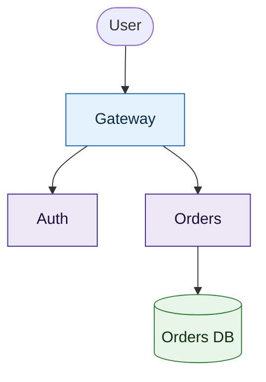

# Fixture 04 — clean (no violations)

```mermaid
flowchart TD
    U([User]) --> GW[Gateway]
    GW --> AUTH[Auth]
    GW --> ORD[Orders]
    ORD --> DB[(Orders DB)]
    classDef edge fill:#e3f2fd,stroke:#1565c0,color:#0d2b4b
    classDef svc  fill:#ede7f6,stroke:#4527a0,color:#1a0e3d
    classDef data fill:#e8f5e9,stroke:#2e7d32,color:#10300f
    class GW edge
    class AUTH,ORD svc
    class DB data
```
