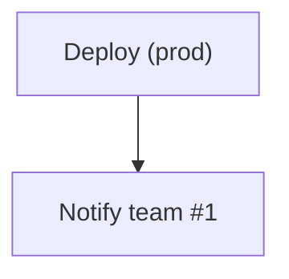
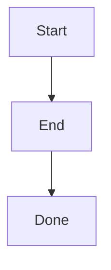
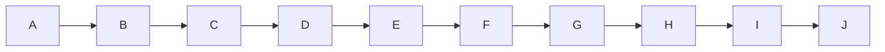
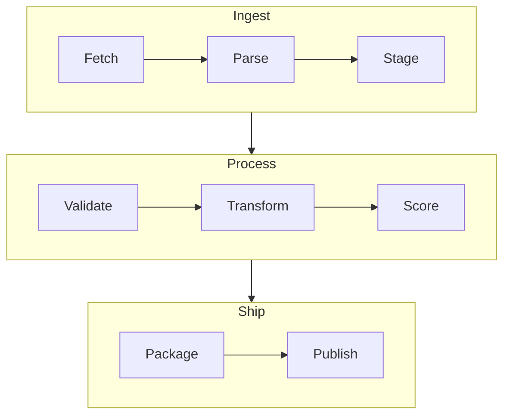
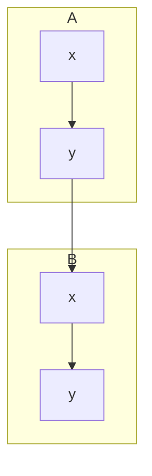
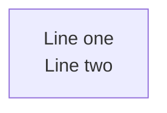
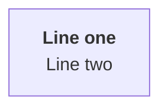

# Good vs. broken Mermaid (Markdown)

Worked pairs. The `examples/*.mmd` files are runnable: `mmdc -i examples/<file>.mmd -o /tmp/x.png`.
Broken ones should fail (non-zero exit / bomb image); good ones should render cleanly.

## 1. Special characters in labels

**Broken** (`examples/bad-unquoted-parens.mmd`) — raw `()` makes Mermaid try to parse a node shape:

```mermaid
graph TD
    A[Deploy (prod)] --> B[Notify team #1]
```

`Parse error … got 'PS'`. Fix: quote the label so the characters are treated as text.

**Good:**



Rule: any label with `( ) [ ] { } < > " | ; #` belongs inside `"…"`. In Markdown you do
**not** use HTML entities (`&quot;`) — they render literally and break the diagram.

## 2. The reserved word `end`

**Broken** (`examples/bad-reserved-end.mmd`) — lowercase `end` closes a subgraph context:

```mermaid
graph TD
    start --> end
    end --> done
```

Fix: capitalize or quote it.

**Good:**



## 3. Layout — renders, but reads badly

**Poor** (`examples/bad-too-wide.mmd`) — a long `LR` chain becomes a thin, very wide strip
that overflows on narrow/mobile views:



**Better** — top-down, grouped into phases, connected **at the subgraph boundary**
(not inner-node to inner-node), with correlated names:



Direction, node count, and grouping are judgment calls — aim for a balanced shape a
reader can scan top-to-bottom.

## 4. Subgraph direction & the cross-edge trap

`examples/good-subgraphs.mmd` shows the pattern: group related nodes, give each
subgraph a `direction`, and connect **subgraphs to subgraphs** (`SG_INGEST --> SG_PROC`).

The trap: if you instead link an *inner* node of one subgraph to an *inner* node of
another, Mermaid's rule kicks in — **"if any of a subgraph's nodes are linked to the
outside, the subgraph's `direction` is ignored and it inherits the parent's
direction."** So this silently loses the `direction LR` you set:



It renders (no syntax error) but both subgraphs fall back to `TD`. Connect
`SG_A --> SG_B` instead to keep your internal layout control.

## 5. Line breaks: `\n` is not a newline



renders the literal `\n` — it does **not** break the line. Use `<br/>`:


or a **markdown string** (backticks inside the quotes), where a real newline works and
you also get `**bold**` / `*italic*`:


