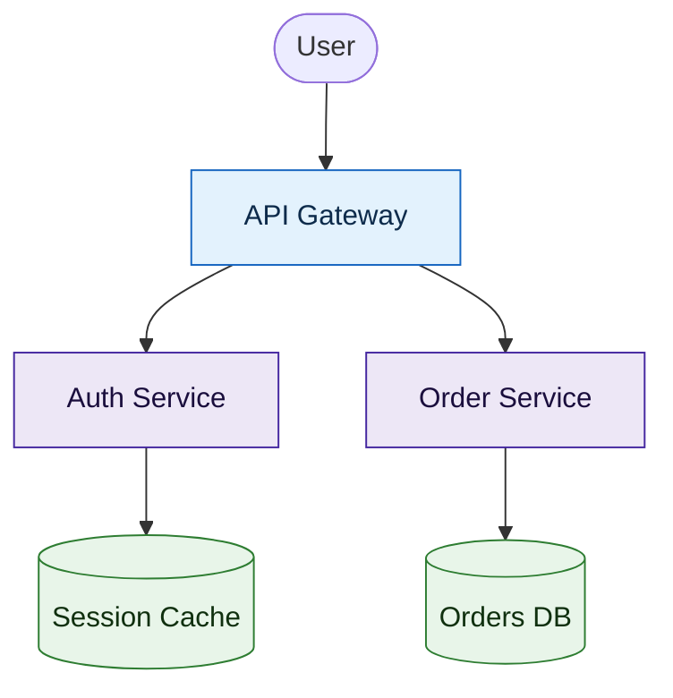

# Sober Mermaid palettes — ready-to-paste `classDef` blocks

Mermaid defaults are flat gray with no emphasis. These palettes encode **semantics**
(role, layer, old-vs-new) with restrained, non-garish color. Every `classDef` here
passes the audit's own contrast gate (C2): fill reads against the white canvas, text
reads against the fill. Combine **one accent against mostly neutral** — accent for the
~10–20% of nodes that matter, neutral for the rest. Pair color with **shape** (rect=step,
diamond=decision, cylinder=store, stadium=start/end) so meaning survives in grayscale.

## A. Structural / layer (Material-like, neutral)

Use for architecture diagrams — distinguish layers without shouting.

```
classDef edge   fill:#e3f2fd,stroke:#1565c0,color:#0d2b4b
classDef svc    fill:#ede7f6,stroke:#4527a0,color:#1a0e3d
classDef data   fill:#e8f5e9,stroke:#2e7d32,color:#10300f
classDef extern fill:#eceff1,stroke:#455a64,color:#1c272c
```

## B. Status / accent (one accent against neutral)

Use to highlight the hot path or a problem node; keep everything else neutral.

```
classDef base fill:#f5f5f5,stroke:#757575,color:#212121
classDef hot  fill:#fff3e0,stroke:#e65100,color:#3e2200
classDef warn fill:#fff8e1,stroke:#b26a00,color:#3a2e00
classDef stop fill:#fdecea,stroke:#c62828,color:#3b0d0a
```

## C. Old-vs-new (migration / before-after)

Use when a diagram contrasts existing vs introduced components.

```
classDef old fill:#eceff1,stroke:#607d8b,color:#1c272c
classDef new fill:#e8f5e9,stroke:#2e7d32,color:#10300f
```

## Combining guidance

- **One accent family per diagram.** Palette A *or* B as the base, plus at most one
  accent. More than ~6 distinct fills trips the garish gate (C3).
- **Don't lean on red-vs-green alone** (C5) — pair it with shape or label so
  red-green-color-blind readers still parse it.
- **Apply by role, not per node:** `class NodeA,NodeB svc` — same role, same class.
- **Markdown strings still work inside styled nodes** for `**bold**` emphasis.

### Worked apply (before → after)


